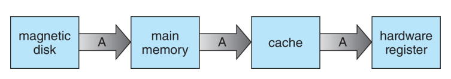

# 01 Introduction

What Operating Systems Do

Computer-System Organization

Computer-System Architecture

Operating-System Operations

Resource Management

Security and Protection

Virtualization

Distributed Systems

Kernel Data Structures

Computing Environments

Free/Libre and Open-Source Operating Systems

## Objectives

알고 가야할 것들

The general organization of a computer system, and the role of interrupts

The components in a modern, multiprocessor computer system

The transition from user mode to kernel mode

how operating systems are used in various computing environments

## Operating System

A program that acts as an intermediary between a user of a computer and the computer hardware

​	컴퓨터 사용자와 컴퓨터 하드웨어 사이를 중개해주는 프로그램

Goal

- 유저 프로그램을 실행하고, 유저의 문제 해결을 쉽게 만들어야함.
- 컴퓨터 시스템을 사용하기 편리하게 만들어야함
- 컴퓨터 하드웨어를 효율적으로 사용해야함

Computer System Structure, 구성 요소

1. Hardware (CPU, memory, i/o etc)
2. OS
3. Application System (browser, db, games etc)
4. User (people, machines, other computers)

OS 하는일 => 시스템마다 다름

- 일반적인 사용자
  -  쉽게 사용하고 좋은 퍼포먼스를 보여야함
- Shared computer 공유 컴퓨터
  - 모든 유저에게 좋은 퍼포먼스를 보여야해서 자원을 분배하고 프로그램을 제어함.
  - HW를 효율적으로 사용하고 사용자 프로그램을 관리함
  - mainframe: 메인프레임 또는 대형 컴퓨터는 통계 데이터나 금융 관련 전산업무, 전사적 자원 관리와 같이 복잡한 작업을 처리하는 컴퓨터이다. 이 용어는 원래 초기 컴퓨터들의 중앙 처리 장치와 메인 메모리를 갖춘 "메인 프레임"이라 불리는 대형 캐비넷들을 지칭하였다
  - minicomputer: 미니컴퓨터는 대형 컴퓨터인 메인프레임과 비슷한 역할을 하되, 그 크기와 성능을 간소화한 컴퓨터이다. 오늘날에는 중형 컴퓨터라고 부르기도 한다. 
- Workstations(dedicate systems)
  - 서버
  - 유저마다 전용 자원이 있지만 서버의 자원을 공유함
- Mobile devices
  - 자원이 적어서 사용성과 배터리를 최적화함

Operating System Definition

- No universally accepted definition. ㅎㅎ..

- Everything a vendor ships when you order an operating system:

  OS를 주문했을때 챙겨주는 모든 것

- Kernel 커널: 컴퓨터에서 항상(all times) 실행되는 하나의 프로그램

- system program: OS와 같이 제공 되지만 커널엔 포함되지 않는 것

- application program: OS와 관련 없는 모든 프로그램

## **Overview of Computer System Structure** 

Computer System Organization

- Computer-system operation
  - common BUS(system bus)를 통해 cpu, device controller 등이 연결되어서 공유 메모리에 대한 액세스를 제공함

컴퓨터 사용할 때, 혹은 게임 돌릴 때 키보드, 마우스, 모니터 등등 같이 쓰는거 생각하면됨

- I/O devices와 cpu는 동시에 실행 가능
- device controller는 local buffer를 가지고 있고, device를 관리하는 os(device driver)가 있음
- cpu를 통해 메인 메모리와 로컬 버퍼 끼리 데이터 이동이 가능함
  - 입력: (device ->)로컬 버퍼)-> cpu -> 메모리
  - 출력: 메모리 -> cpu -> 로컬 버퍼 (-> device)

- interrupt를 발생시켜서 i/o작업이 끝났다고 알림

Interrupt

프로그램: 메모리에 적재되어있음

- Interrupt는 일반적으로 모든 서비스 루틴의 주소를 포함하는 인터럽트 벡터를 통해 인터럽트 서비스 루틴으로 제어를 전송함
  - 인터럽트: 해당 프로그램을 잠시 정지하고 인터럽트 서비스 루틴이 있는 메모리로 점프함. 필요한 행동(서비스 루틴)을 실행시키고 종료되면 정지되었던 프로그램 다시 실행
  - os 프로그램에 특정 인터럽트에 대한 함수 주소를 모아두는 곳이 있음 (인터럽트 벡터)
  - 해당 메모리가 가리키고 있는 함수 실행 (인터럽트 서비스 루틴)
- 인터럽트 아키텍처는 인터럽트된 명령의 주소를 저장함.
  - 인터럽트 서비스 루틴이 다 끝나면 이전에 실행하고 있던 프로그램으로 다시 넘어가야함.
- 트랩 또는 예외는 오류 또는 사용자 요청에 의해 발생하는 소프트웨어 생성 인터럽트입니다.
  - 예전 컴퓨터에 자주 뜨던 메모리 용량
  - 메모리 용량 부족으로 인터럽트 실행 -> 블루스크린 화면에 보여주고 재부팅(서비스 루틴)
- 운영 체제는 인터럽트 기반

인터럽트 타임라인

1. cpu와 io device는 같이 실행 가능
   - I/O request 가 생겨도 CPU는 user program 실행
2. i/o device 의 작업이 끝나면 interrupt 실행
3. cpu에서 interrupt를 받으면 io processing 실행
4. 다 끝나면 다시 user program 실행

인터럽트 핸들링

- 운영 체제는 레지스터와 프로그램 카운터를 저장하여 CPU의 상태를 유지합니다.
  - CPU의 상태 = register, PC(program counter)
  - register는 현재 연산중인 데이터가 저장되어있음(cache, memory는 속도를 위한 거)
  - pc는 현재 진행중인 프로그램의 위치를 알려줌
  - 즉 PC와 register만 저장하면 다시 불러오면 프로그램 복구 가능
- 발생한 인터럽트 유형을 결정합니다.
  - 어떤 인터럽트인지. 에러인지 i/o인지 등
- 코드의 개별 세그먼트는 각 인터럽트 유형에 대해 수행해야 할 작업을 결정합니다.

Interrupt-drive I/O Cycle

- 타임라인에 인터럽트 핸들링을 더한 내용

I/O structure

1. I/O가 시작된 후에는 I/O 완료 시에만 제어가 사용자 프로그램으로 돌아갑니다. polling
   - I/O가 시작된 후에는 I/O 완료 시에만 제어가 사용자 프로그램으로 돌아갑니다.
   - 대기 명령은 다음 인터럽트까지 CPU를 유휴 상태로 만듭니다.
   - 대기 루프(메모리 액세스에 대한 경합)
   - 한 번에 하나의 I/O 요청이 미결 상태이며, 동시 I/O 처리가 불가능합니다.

2. I/O가 시작되면 I/O가 완료될 때까지 기다리지 않고 제어가 사용자 프로그램으로 돌아갑니다. interrupt
   - System Call: 사용자가 I/O 완료를 기다릴 수 있도록 OS에 요청
   - Device-status table: 유형, 주소 및 상태를 나타내는 각 I/O 디바이스의 항목이 포함함.
   - OS  indexes 를 I/O 장치 테이블에 넣습니다. 
   - I/O device table은 장치 상태를 결정하고, 인터럽트를 포함하는 테이블 항목을 수정함

Computer Startup(Booting)

- 전원을 켜거나 재부팅할 때 부트스트랩 프로그램이 로드됩니다.
- 일반적으로 ROM 또는 EPROM에 저장되며 일반적으로 펌웨어라고 함
- 시스템의 모든 측면을 초기화합니다.
  - 기본장치 cpu, ram, vga 등 연결되어있는 제품들이 정상인지 확인하고 아무것도 없는 상태로 만듦
- 운영 체제 커널을 로드하고 실행을 시작합니다.
  - windows나 mac os 같은 운영체제를 시작함

## Storage Structure

Main memory: Random access memory(RAM), 휘발성 

- 주로 RAM이라고 말하는건 DRAM임

Secondary storage: **nonvolatile**

1. NVM(non-volatile memory): SSD, USB
   - NVMe: non-volatile memory express, ssd를 위한 통신 규격 => SATA나 PCIe보다 빠름
2. HDD
   - 트랙, 섹터

Tertiary storage:

1. CD, DVD, blu-ray

2. magnetic tapes, (floppy disk)

   The 5.25-inch disks were dubbed "**floppy**" because the diskette packaging was a very **flexible plastic envelope**,

Storage Definitions and Notation Review

bit: 0, 1 

- ON, OFF

1 byte: 8 bit

- 컴퓨터는 바이트를 최소 단위로 사용함

word: 기본 데이터 단위. word 크기로 작업 실행

- 32 bit 운영체제: 32 bit = 4 byte = 1 word
- 64 bit 운영체제: 64 bit =  8 byte = 1 word

Storage Hierarchy

- CPU와 가까울수록 속도가 빠르고, 비용이 큼. 그리고 휘발성임 
- Caching: 더 빠른 스토리지 시스템에 복사
  - 게임 실행을 예로 들면 다음과 같음. 각 계층마다 속도차이가 있음
  - 실제로 게임이 저장되어있는 곳은 SSD나 HDD(속도 낮음)
  - 프로그램을 실행하면 RAM에 필요한 부분 적재(속도 어느정도 나옴)
    - RAM이 작으면 프로그램 실행할때 SSD, HDD에 자주 접근해서 느려짐
  - cache memory: ram의 일부분을 올려보내서 cpu연산이 빠르도록 도움 (dram보다 빠름)
  - 실제 연산: CPU(제일 빠름)
- Device Driver:  컨트롤러와 커널 간에 균일한 인터페이스를 제공함.

How a Modern Computer Works

1. 폰 노이만 구조(A von Neumann architecture)

   프로그램(instruction)과 데이터를 같은 곳(메모리)에 저장함

DMA(direct memory access)

- 메모리 속도에 가까운 속도로 정보를 전송할 수 있는 고속 I/O 장치에 사용
- 장치 컨트롤러가 CPU 개입 없이 버퍼 스토리지에서 메인 메모리로 데이터 블록을 직접 전송
- 바이트당 인터럽트가 아닌 블록당 하나의 인터럽트만 생성.

Operating-System Operations

1. Bootstrap program – simple code to initialize the system, load the kernel
2. Kernel loads
3. Starts **system daemons**: 커널의 바깥에서 돌아감
4. Kernel **interrupt driven** (hardware and software): 커널은 인터럽트 기반
   - hardware interrupt: i/o
   - software interrupt: exception, trap
     - error(division by zero), infinite loop, modifying each other or OS, etc
     - 발생시 system call 을 요청함

Multiprogramming (Batch system)

- 하나의 프로세서에서 여러 프로그램(프로세스)을 교대로 수행할 수 있게 하는 것

- 단일 사용자가 CPU 및 I/O 디바이스를 항상 사용할 수는 없음
- 멀티프로그래밍은 작업(코드 및 데이터)을 정리하므로 CPU는 항상 작업 하나를 실행해야 함.
- 시스템의 모든 작업은 메모리에 보관됨(메모리를 쓰지 않는 경우도 있음).
- 작업은 scheduling을 통해 선택되고 실행됨.
- 작업이 대기해야 하는 경우(예: I/O), OS는 다른 작업으로 전환됨

Multitasking (Timesharing)

- A logical extension of Batch systems
- CPU는 작업을 자주 스위치함. 1초 미만의 response time
- process: 메모리에서 실행되고 있는 프로그램
- CPU scheduling: 여러 작업을 동시에 실행할 준비가 된 경우(대기하고 있는 경우) 선택
- 프로세스가 메모리에 맞지 않는 경우(사용하는 메모리가 큰 경우) swap 사용
  - 프로세스를 실행하기 위해 메모리에 올렸다 내렸다 함.
- 가상 메모리를 사용해서 메모리에 다 들어가지 않아도 실행 가능

Dual-mode Operation

- OS는 Dual-mode 운영을 통해 자체 및 기타 시스템 구성 요소를 보호할 수 있음
- 하드웨어에 있는 mode-bit 를 사용해서 모드를 구별함
- System call이 호출될 때 커널 모드, 유저 모드로 변경함

1. User mode: Running user program 

2. kernel mode: Running kernel code 

   특정 instruction은 커널모드에서만 실행되도록 설계됨

Timer

- 무한 루프나 process hogging resources(중요도나 기능에 비해 시스템 자원을 많이 소모하는 경우)를 방지하기 위한 것
- OS가 설정하고 일정 시간(실제 시간으로 측정함) 후  counter가 0이 되면 인터럽트 발생
- 제어 권한을 되찾거나 할당된 시간을 초과한 프로그램을 종료하도록 예약 프로세스 전에 설정
  - 무슨말이지

Process Management

- Process는 실행 중인 프로그램이고 시스템 내의 작업 단위입니다. 
  - Program은 수동적인 엔터티이고, Process는 능동적인 엔터티입니다. 대충 뉘앙스 차이인듯

- Process는 수행하기위해 리소스를 필요로함(CPU, memory, I/O, files,Initialization data)
- Process를 종료하기위해 재사용 가능한 자원을 반환함
- PC는 프로세스당 하나가 있음. 실행할 다음 명령의 위치를 지정함.
  - Single-threaded process: PC 하나
  - Multi-threaded process: 스레드당 PC하나
- 프로세스가 완료될 때까지 PC가 가리키는 명령을 순차적으로 실행함
- 일반적으로 시스템에는 여러 프로세스, 여러 사용자, 여러 운영 체제가 하나 이상의 CPU에서 동시에 실행됨
  - 프로세스와 스레드를 멀티플렉싱하여 CPU를 사용함. -> 동시성 확보

Process Management Activities

- OS 가 해야하는 일

  - 사용자 및 시스템 프로세스 모두 생성 및 삭제

  - 프로세스 일시 중단 및 재개

  - 프로세스 동기화를 위한 메커니즘 제공

  - 프로세스 커뮤니케이션을 위한 메커니즘 제공

  - 교착 상태 처리를 위한 메커니즘 제공

Memory Management

- 프로그램을 실행하려면 instruction과 데이터가 메모리에 있어야 합니다.
  - 폰노이만 구조
- 메모리 관리는 메모리 안에 항목과 시기(어떤 값이 언제까지 있을지)를 결정합니다.
  - CPU 활용률 및 사용자에 대한 컴퓨터 응답 최적화
- 메모리 관리 활동
  - 메모리의 현재 사용 중인 부분과 사용 대상 추적
  - 메모리 내부 및 외부로 이동할 프로세스(또는 그 부분) 및 데이터 결정
  - 필요에 따라 메모리 공간 할당 및 할당 취소

File-system Management

- OS는 스토리지에 통일되고 논리적인 정보를 제공합니다.
  - file: 물리적 속성을 논리적 저장 단위로 추상화한 것
  - 각 매체는 저장 장치에 의해 제어됩니다.
    - 액세스 속도, 용량, 데이터 전송 속도, 액세스 방법(순차 또는 랜덤)
- 파일 시스템 관리
  - 일반적으로 디렉터리로 구성된 파일
  - 대부분의 시스템에서 액세스 제어를 통해 누가 무엇을 액세스할 수 있는지 확인
  - OS 활동
    - 파일 및 디렉터리 만들기 및 삭제
    - 파일 및 디렉토리를 조작하는 기본 기능
    - 파일을 보조 저장소에 매핑
    - 안정적인(비휘발성) 스토리지에 파일 백업

Mass-Storage Management

- main memory에 맞지 않는 데이터나 오랫동안 보관해야 하는 데이터
- 적절한 관리가 가장 중요
- 전체 컴퓨터 작동 속도는 디스크 하위 시스템과 해당 알고리즘에 달려 있음
- OS 활동
  - 마운트 및 마운트 해제(usb hdd 등 드라이브 삽입, 제거)
  - 자유 공간 관리
  - 스토리지 할당
  - 디스크 예약
  - 파티셔닝(논리적으로 분할)
  - 보호

Caching

- 컴퓨터의 여러 수준에서 수행되는 중요한 원칙(하드웨어, 운영 체제, 소프트웨어)

- 사용 중인 정보가 저속 스토리지에서 고속 스토리지로 일시적으로 복사됨
- 캐시를 먼저 확인하여 정보가 있는지 확인함
  - 정보가 있으면 캐시에서 직접 사용
    - copy를 하지 않으므로 빠름
  - 없으면, 데이터를 캐시에 복사한 뒤 사용
- 캐시는 스토리지보다 작음
  - 캐시 관리 중요 설계 문제
  - 캐시 크기 및 교체 정책
  - 캐시가 스토리지보다 항상 작으므로 캐시 크기나 데이터를 교체하는 등 캐시를 관리하는게 중요한 문제임

Characteristics of Various Types of Storage

- level이 내려갈수록 크기는 크고 속도는 느림

- register는 cpu가 사용하는 가장 빠른 저장소라고 생각하면됨

- 얘도 main memory(dram) 과 속도 차이가 많이 나기때문에 중간 단계인 cache를 사용함

  - 여기서 말하는 cache는 cpu 안에 있는 캐시를 뜻함
  - caching은 저속에서 고속 스토리지로 올리는 것을 뜻함(메인 메모리에서 중간단계인 cache로 올리는 것도 캐싱임)

  

Migration of data “A” from Disk to Register

- 멀티태스킹 환경에서는 저장소 계층의 저장 위치에 관계없이 최신 값을 사용하도록 주의해야 합니다.
- 멀티프로세서 환경은 하드웨어에 캐시 일관성을 제공해야 합니다.
  -  모든 CPU가 캐시에서 최신 값을 가지게끔
- 분산 환경 상황은 훨씬 더 복잡함
  - 데이터의 여러 복사본이 존재할 수 있음
    

​	

I/O Subsystem

- OS의 목적 중 하나는 사용자로부터 하드웨어 장치의 특성을 숨기는 것 -> 추상화 -> 몰라도 쓸수 있게

- i/o subsystem 역할
  - I/O의 메모리 관리
    - 버퍼링: 데이터 전송 중에 일시적으로 저장
    - 캐싱: 성능을 위해 데이터의 일부를 더 빠른 스토리지에 저장
    - 스풀링: 한 작업의 출력과 다른 작업의 입력이 겹치는 것
    - 등등
  - 일반 장치 드라이버 인터페이스
  - 특정 하드웨어 장치용 드라이버

Protection and Security

1. Protection: OS에 의해 정의된 리소스에 대한 프로세스 또는 사용자의 액세스를 제어하는 모든 메커니즘
2. Security: 내부 및 외부 공격으로부터 시스템 방어
   - DoS(서비스 거부), warm, 바이러스, 신원 도용, 서비스 도용 등의 공격

- 시스템은 일반적으로 먼저 사용자를 구별하여 누가 무엇을 할 수 있는지 판단합니다. 

  (리눅스 시스템 생각하면 편할듯)

  - User identities (user IDs, security IDs)에는 사용자당 하나씩 이름 및 관련 번호가 포함됨.
  - user ID는 모든 파일과 프로세스에 연결되어있고, 사용자가 액세스 할 수 있는지 결정함
  - group ID를 통해 모든 파일과 프로세스에 사용자 제어 권한을 줄 수 있음
  - Privilege escalation(권한 상승)으로 사용자는 더 많은 권한을 가진 유효한 ID로 변경할 수 있음

Virtualization

- 가상화로 OS 내에 다른 OS의 애플리케이션을 실행할수 있음

- **Emulation**

  - cpu 유형이 다른 경우 (windows에서 MS-DOS 게임 돌리는 것 혹은 windows에서 오락실 게임을 돌리는 것)
  - 일반적으로 가장 느림
  - **Interpretation**: native code로 컴파일 되지 않은 경우

- **Virtualization**

  - CPU에 맞게 컴파일된 OS(host)에 다른 OS(guest)도 CPU에 맞게 컴파일된 경우
  - VMM(virtual machine Manager)에서 가상화 서비스 제공

- 한 컴퓨터에 여러 OS를 돌리는 것도 가상화임

  

Distributed Systems

- 서로 네트워크로 연결된 이기종일 수 있는 개별 시스템 모음
  - 네트워크는 통신 경로이며 TCP/IP가 가장 일반적
    - Local Area Network (LAN)
    - Wide Area Network (WAN)
    - Metropolitan Area Network (MAN)
    - Personal Area Network (PAN)
- 네트워크 운영 체제는 네트워크 전체의 시스템 간에 기능을 제공함
  - 통신 체계를 통해 시스템이 메시지를 교환할 수 있음
  - 단일 시스템인 것처럼 보임

## Computer System Architecture

대부분의 시스템은 Single general-purpose 프로세서를 사용하고 special-purpose 프로세서들을 가지고 있음

Multiprocessors는 사용이 늘어나고 중요도이 증가함.

- parallel systems, tightly-coupled systems 로도 알려짐

- 장점

  - 처리량(throughput)이 증가

  - Economy of scale: 투입규모가 커질수록 장기 평균 비용이 줄어드는 현상(규모의 이익)

  - 안정성이 향상함 

    - graceful degradation: 치명적인 오류 등으로 작동 불능 상태가 된 경우에도 제한된 기능을 유지함

    - fault tolerance(내결함성): 하나 이상의 구성요소에 장애가 발생하더라도 중단 없이 계속 동작할수 있음

    - https://www.techtarget.com/searchnetworking/definition/graceful-degradation

      https://avinetworks.com/glossary/fault-tolerance/

- 유형

  1. Asymmetric Multiprocessing(비대칭형 다중 처리)

     - 프로세서 마다 특정 작업이 할당됨
     - 마스터 프로세서만 운영체제의 작업을 실행함

  2. Symmetric Multiprocessing(대칭형 다중 처리) 

     - 각 프로세서가 운영체제의 작업을 수행함

     - 같은 아키텍처를 가지고 있음

       

Dual core Design

Non-Uniform Memory Access System

Clustered Systems

- multiprocessor system과 비슷하지만 여러 시스템(multiple systems) 함께 동작함

  - Storage Area Network(SAN)로 스토리지를 공유함

  - 장애를 극복하는 high-availability(고가용성) 서비스를 제공
    - Asymmetric clustering 는 hot-standby mode 상태인 머신을 가지고 있음
    - Symmetric clustering 는 다수의 노드를 가짐. 해당 노드는 애플리케이션을 구동하고 각 노드를 서로 감시함
  - 일부 클러스터는 고성능 컴퓨팅(high-performance computing, HPC)용입니다.
    - 병렬화를 사용하려면 애플리케이션을 작성해야 함
  - 충돌을 방지하기 위해 DLM(distributed lock manager, 분산 잠금 관리자)을 설치한 곳도 있음.

## Computer System Environments

Computing Environments

1. Traditional

   - Stand-alone general-purpose machines -> 인터넷 등으로 서로 연결되면서 모호해짐
   - 포털은 내부 시스템에 대한 웹 액세스를 제공함
   - 네트워크 컴퓨터(씬 클라이언트)는 웹 터미널과 같음
   - 무선 네트워크를 통한 모바일 컴퓨터 상호 연결
   - 네트워킹이 보편화됨 – 가정용 시스템도 방화벽을 사용하여 가정용 컴퓨터를 인터넷 공격으로부터 보호

2. Mobile

   - 휴대용 스마트폰, 태블릿
   - 기존 노트북과의 차이점? GPS, gyroscope 같은 더 많은 OS 기능
   - 증강현실과 같은 새로운 유형의 앱
   -  IEEE 802.11 wireless(Wi-Fi), or cellular data networks를 사용해서 

3. Client Server

   - Many systems now servers, responding to requests generated by clients

   - 클라이언트를 위한 인터페이스 제공

     - 컴퓨팅 서버 시스템은 클라이언트가 서비스를 요청(request)할 수 있는 인터페이스를 제공함

     - 파일 서버 시스템은 클라이언트가 파일을 저장하고 검색할 수 있는 인터페이스를 제공함

4. Peer-to-Peer (P2P)

   - Another model of distributed system

   - P2P는 클라이언트와 서버를 구분하지 않고 모든 노드가 피어로 간주됩니다. 
   - 각각 클라이언트와 서버의 역할을 함
   - 노드는 P2P 네트워크에 들어가야함
     - 네트워크의 중앙 Lookup Service에 서비스를 등록
     - 서비스 요청을 브로드캐스트하고 검색 프로토콜을 통해 서비스 요청에 응답
   - Ex) Voice over IP (VoIP) such as Skype 

5. Cloud computing

   - 네트워크를 통해 컴퓨팅, 스토리지, 서비스형 애플리케이션(AppaaS) 제공

   - 가상화 기능을 기반으로 사용하므로 Virtualization의 논리적 확장입니다. 

   - Ex) Amazon EC2

   - Type

     1. Public cloud – 인터넷을 통해 이용 가능

     2. Private cloud – 회사 내에서 사용하는 것을 목적으로 사용

     3. Hybrid cloud – public, private 둘다 사용

     4. Software as a Service (SaaS) – 서비스형 소프트웨어

        - 인터넷을 통해 하나 이상의 애플리케이션(소프트웨어)을 사용(제공)함
        - i.e., word processor

     5. Platform as a Service (PaaS) – 서비스형 플랫폼

        - 인터넷을 통해 software, hardware 플랫폼을 사용(제공)함
        - i.e., a database server

     6. Infrastructure as a Service (IaaS) – 서비스형 인프라구조

        - 인터넷을 통해 사용 가능한 서버나 스토리지 등의 서버 자원(infrastructure)을 사용(제공)함

        - i.e., storage available for backup use

   - 클라우드 컴퓨팅 환경은 traditional OS, VMM 및 클라우드 관리 툴로 구성됨

   - 인터넷 연결을 위해서는 방화벽과 같은 보안이 필요함

   - Load balancer 가 트래픽을 여러 애플리케이션에 분산함

6. Real-time Embedded

   - 가장 널리 사용되는 컴퓨터 형태
     - 다양함, 특수 목적, 제한된 목적 OS, 실시간 OS
     - 확장 사용
   - 다른 많은 특수 컴퓨팅 환경도 마찬가지
     - 일부는 OS가 있고 일부는 OS 없이 작업을 수행함
   - 실시간 OS는 명확하게 정의된 고정 시간 제약을 가짐
     - 제약 조건 내에서 처리해야 함
     - 제약 조건이 충족된 경우에만 올바르게 작동함

7. Free and Open-Source Operating Systems

   - 폐쇄적이고 독점적인 운영 체제가 아닌 소스 코드 형식으로 제공되는 운영 체제
   - 복사 방지 및 디지털 권한 관리(DRM) 운동에 반대해서 만들어짐
   - Free Software Foundation (FSF)에 의해 시작
     - “copyleft” GNU Public License (GPL)를 가지고 있음
   - Free software와 open-source source는 다름

## Kernel Data Structure

Many similar to standard programming data structures

- Singly linked list

- Doubly linked list

- Circular linked list

- Binary search tree

  - left <= right

  - Search performance is O(n)

    이진 트리라고 해도 한쪽으로 몰릴수 있으므로 최악은 전체 순회

  - Balanced binary search tree is O(log n)

- Hash map - Hash function can create it

- Bitmap – n 개 항목의 상태를 나타내는 n 자리 이진수 문자열

- Linux 데이터 구조는 다음 파일에 정의됨 <linux/list.h>, <linux/kfifo.h>, <linux/rbtree.h>
