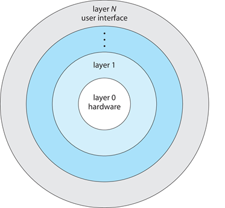

# Chapter 2: Operating-System Services

**Operating System Services**

OS는 프로그램과 사용자에게 프로그램이나 서비스의 실행환경을 제공함

사용자를 위한 유용한 기능

- User Interface (UI)
  - Command Line interface(CLI), Graphics User Interface(GUI), touch screen, batch etc..
- 프로그램 실행
  - 시스템은 프로그램을 메모리에 올릴수 있어야하고 실행시킬 수 있어야함. 프로그램 종료도 가능(정상 종료, 비정상 종료 모두 포함해서)
- 입출력 작업
- 파일 시스템 조작(file system manipulation)
  - (파일과 디렉터리) 읽기, 쓰기, 생성, 삭제, 검색(search),나열(list), 권한 관리

- 통신(Communications)
  - 동일 컴퓨터 내, 네트워크 상 통신
- Error Detection
  - CPU, memory, io, user program 등에서 에러 발생가능
  - 각 오류에 대해 적절한 조치 필요
  - 디버깅

OS 자체적으로 사용하는 기능

- 리소스 할당(resource allocation)
  - 여러 사용자, 여러 작업이 동시실행되는 경우 각각에게 리소스를 할당해야함
  - 리소스 종류: CPU cycle, main memory, file storage, I/O devices
- Logging
  - 어떤 사용자가 얼마나 많이 사용하고 어떤 종류의 컴퓨터 리소스를 사용하는지 추적
- 보호 및 보안(Protection, Security)
  - 특정 정보의 사용을 제어할 수 있고, 동시 프로세스가 서로 간섭하지 않아야 함
  - Protection: 시스템 리소스에 대한 모든 액세스가 제어됨
  - Security: 외부자로부터 시스템을 보안하려면 사용자 인증이 필요하며, 잘못된 액세스 시도로부터 외부 I/O 디바이스를 보호하는 것으로 확장됨.

**Command Line interpreter** 

- CLI 에서 직접 명령 입력 허용
- 커널 안이나 시스템 프로그램에 의해 구현됨
- shells: 여러 종류가 있음
- 사용자로부터 명령을 가져와서 실행함
- 기본 내장되어있는 명령어로 실행할수 있음(프로그램 이름으로 사용)
  - 새기능을 추가할때 shell을 수정하지않음

**User Operating System Interface - GUI**

- 사용자 친화적
- 키보드 마우스 모니터를 사용함
- 아이콘으로 파일, 프로그램 등을 나타냄

**Touchscreen Interfaces**

- 새로운 인터페이스 사용
  - 가상 키보드
  - 제스처 기반 작업
- 음성명령 등

**System Calls**

- OS에서 제공하는 서비스에 대한 프로그래밍 인터페이스
- C/C++ 같은 high-level language로 작성됨
- 직접 system call을 사용하지않고 API(Application Programming Interface)를 통해 프로그램에 접근
- Examples
  - Win32 API for Windows
  - POSIX API for POSIX-based systems (including virtually all versions of UNIX, Linux, and Mac OS X)
  - Java API for the Java virtual machine (JVM)

**System Call Implementation**

- 각각의 system call은 번호가 연결됨.
  - 시스템 콜 인터페이스는 이 숫자들을 테이블에 indexing함
- 시스템 콜 인터페이스는 OS 커널에서 의도된 시스템 콜을 부르고, 끝날 때 상태와 반환 값을 반환함
- 호출자(Caller)는 시스템 호출 구현 방법에 대해 알 필요가 없음(추상화)
  - API를 준수하고 OS가 호출 결과에 따라 수행할 작업만 파악하면 됨
  - API에 의해 프로그래머로부터 숨겨진 OS 인터페이스의 대부분의 세부 정보
    - 런타임 지원 라이브러리(컴파일러에 포함된 라이브러리에 내장된 함수 집합)에 의해 관리됨

**System Call Parameter Passing**

- 원하는 시스템 콜의 ID보다 더 많은 정보가 필요한 경우가 종종 있음
- 시스템 콜의 파라미터는 OS와 call에 따라 매개변수의 타입과 정보량이 다름
- 일반적인 방법
  - 레지스터에 매개변수 전달, 가끔 레지스터보다 많은 매개변수 전달
  - 블록, 테이블, 메모리, 블록등의 주소를 매개변수로 전달
    - Linux, solaris 
  - 프로그램에 의해 스택에 배치되거나(push) 매개변수 및 운영 체제에 의해 스택에서 제외된 매개변수
  - 블록 및 스택 메서드는 전달되는 매개 변수의 수 또는 길이를 제한하지 않습니다

**Types of System Calls**

- Process control
  - create process, terminate process
  - end, abort
  - load, execute
  - get process attributes, set process attributes
  - wait for time
  - wait event, signal event
  - allocate and free memory
  - Dump memory if error
  - Debugger for determining bugs, single step execution
  - Locks for managing access to shared data between processes
- File management
  - create file, delete file
  - open, close file
  - read, write, reposition
  - get and set file attributes
- Device management
  - request device, release device
  - read, write, reposition
  - get device attributes, set device attributes
  - logically attach or detach devices
- Information maintenance
  - get time or date, set time or date
  - get system data, set system data
  - get and set process, file, or device attributes
- Communications
  - create, delete communication connection
  - send, receive messages if message passing model to host name or process name
    - From client to server
  - Shared-memory model create and gain access to memory regions
  - transfer status information
  - attach and detach remote devices
- Protection
  - Control access to resources
  - Get and set permissions
  - Allow and deny user access

**System Services**

- 시스템 프로그램은 프로그램 개발 및 실행에 편리한 환경을 제공함
  - 일부는 단순히 시스템 호출에 대한 사용자 인터페이스이고, 다른 일부는 상당히 복잡함
- 운영 체제에 대한 대부분의 사용자의 시각(?)은  시스템 프로그램에 의해 정의됨. 실제 시스템 호출이 아님
- File management 파일 관리
  - Create, delete, copy, rename, print, dump, list, and generally manipulate files and directories
- Status information 상태 정보 
  - 날짜, 시간, 사용 가능한 메모리 양, 디스크 공간, 사용자 수 등의 정보 요청
  - 자세한 성능, 로깅 및 디버깅 정보 제공
  - 구성 정보를 저장하고 검색하는 데 사용되는 레지스트리 구현
- File modification 파일 수정
  - 파일을 만들고 수정할 텍스트 편집기 제공
  - 파일 내용을 검색하거나 텍스트 변환을 수행하는 특수 명령
- Programming language support
  - 컴파일러, 어셈블러, 디버거 및 인터프리터 제공
- Program loading and execution
  -  Absolute loaders
  - relocatable loaders
  - linkage editors
  - overlay-loaders
  - debugging systems for higher-level and machine language
- Communications
  - 프로세스, 사용자 및 컴퓨터 시스템 간에 가상 연결을 만드는 메커니즘 제공
    - 사용자가 다른 사용자의 화면으로 메시지 보내기
    - 웹 페이지 접속
    - 이메일 송수신
    - 원격 로그인
    - 한 컴퓨터에서 다른 컴퓨터로 파일 전송 허용
- Background services
  - 부팅 시 실행
    - 일부는 시스템 시작할때만 쓰이고 바로 종료됨
    - 일부는 부팅이후 부터 종료할 때까지 실행
  - 디스크 검사, 프로세스 예약, 오류 기록, 인쇄 등의 기능 제공
  - 커널 컨텍스트가 아닌 사용자 컨텍스트에서 실행
  - services, subsystems, daemons 으로 알려짐
- Application programs 응용 프로그램
  - 시스템에 관련되지 않음
  - 사용자에 의해 실행
  - 일반적으로 OS에 포함되지 않음
  - command line, 마우스 클릭(GUI 환경) 등으로 실행

**Linkers and Loaders**

- Relocatable object file: 소스 코드를 컴파일(compile) 하면 만들어짐. 실제 메모리에 로드되는 파일
- Linker: obj 파일을 하나의 바이너리 실행 파일(executable file)로 묶음. 라이브러리도 같이 포함됨
  - 정적 라이브러리는 포함됨
  - 동적 라이브러리는 실행파일로 연결하지 않음
    - 동적 링크된 라이브러리(Windows, DLL)는 필요에 따라 로드
    - 동일한 버전의 라이브러리를 사용하는 모든 사용자가 공유(한 번 로드됨).
- 이진 실행 파일로 보조 스토리지에 존재함
- 로더에 의해 메모리에 가져와서 실행함
  - Relocation: 메모리에 주소를 할당하고, 해당 주소에 맞게 프로그램의 코드와 데이터 조정
- 객체, 실행 파일에는 표준 형식이 있으므로 운영 체제가 이를 로드하고 시작하는 방법을 알고 있습니다.

**응용 프로그램이 운영체제마다 다른 이유**

- 운영체제 마다 고유한 시스템 콜이 있음(ex. 파일 형식)
- 여러 운영체제에 맞게 만드는 방법
  - 인터프리터 언어로 작성(python, ruby) -> 여러 운영체제 지원
  - 실행 어플리케이션을 포함하는 virtual machine 을 포함한 언어로 작성(java, jvm)
  -  표준언어로 작성하고 각 운영체제에서 컴파일
- Application Binary Interface (ABI)
  -  API와 동등한 아키텍처
  - 주어진 아키텍처, CPU 등에서 주어진 운영 체제에 대해 바이너리 코드의 다양한 구성 요소가 인터페이스하는 방법을 정의함

**Design and Implementation**

- 운영 체제의 내부 구조는 매우 다양할 수 있습니다.
- 목표(Goal)와 사양(spec)을 정의함
- 하드웨어와 시스템 유형에 영향을 받음
- 사용자 목표 및 시스템 목표
  - 사용자 목표 – 운영 체제는 사용하기 쉽고, 배우기 쉽고, 안정적이고, 안전하고, 빨라야 함
  - 시스템 목표 – 운영 체제는 설계, 구현 및 유지 관리가 쉽고 유연하고 안정적이며 오류가 없고 효율적이어야 함

**Policy and Mechanism**

- Policy: 완료시키기 위해 무엇을 필요로 하는지(Example: Interrupt after every 100 seconds)
- Mechanism: 어떻게 일하는 지 (Example: timer)
- 중요한 원칙: 메커니즘에서 정책(Policy)을 분리함
  - 정책 결정이 나중에 변경될 경우 최대의 유연성을 허용함

**Operating System Structure**

- General-purpose OS is very large program

**Monolithic Structure – Original UNIX**

- Original UNIX의 OS는 제한된 구조임. 하드웨어 기능에 의해 제한됨

- UNIX OS

  - System programs
  - Kernel
    - 하드웨어와 시스템 콜 인터페이스 사이 모든것
    - 파일 시스템, CPU 스케줄링, 메모리 관리 등의 기능

- monolithic + modular

  

**Layered Approach**

- OS는 여러 계층으로 나뉘며, 각각 하위 계층 위에 구축된다. 맨 아래 계층(layer 0)은 하드웨어이고 가장 높은 계층(layer N)은 사용자 인터페이스입니다.
- 모듈화를 통해 계층은 각각 하위 계층의 기능(운영)과 서비스만 사용하도록 선택됩니다.

**Microkernels**

- kernel보다 user 공간에 가까움
- 메시지 전달을 사용하여 사용자 모듈 간에 통신이 이루어집니다
- 장점
  - 확장 용이
  - 운영 체제를 새로운 아키텍처로 더 쉽게 포팅
  - 신뢰성이 높아짐(커널 모드에서 실행되는 코드 수가 적음)
  - 보안 강화
- 단점
  - 유저 - 커널 통신에 대한 성능 오버헤드

**Modules**

- 많은 최신 운영 체제는 로드 가능한 커널 모듈(implement loadable kernel modules, LKMs)을 구현합니다.
- 객체 지향 접근 방식 사용
- 각 핵심 구성 요소는 분리되어 있습니다.
- 각각 알려진 인터페이스를 통해 상대방과 대화합니다.
- 각각은 커널 내에서 필요에 따라 로드할 수 있습니다.
- 전반적으로 레이어와 유사하지만 유연성이 더 높습니다.

**Hybrid Systems**

- 대부분의 최신 운영체제는 여러 모델을 결합해서 사용

  - 성능, 보안, 사용 편의성 요구 해결

  - Linux, solaris: monolithic + modular

  - Windows: monolithic + microkernel

  - Mac OS: microkernel + Unix part + i/o kit + loadable modules

    

    

**iOS**

- Mac OS X 에 기능이 추가된 구조
- OS X applications을 native로 구동시킬수 없음
- CPU architecture 도 다름 (ARM)
- Cocoa Touch Objective-C API for developing apps
- Media services layer for graphics, audio, video
- Core services provides cloud computing, databases
- Core operating system, based on Mac OS X kernel

**Android**

- iOS와 유사한 스택
- Linux 커널 기반이지만 수정됨
  - 프로세스, 메모리, 장치 드라이버 관리 제공
  - 전원 관리를 추가
- 런타임 환경에는 핵심 라이브러리 집합과 Dalvik 가상 시스템이 포함됨
- 라이브러리에는 웹 브라우저(웹킷), 데이터베이스(SQLite), 멀티미디어, 소형 libc용 프레임워크가 포함됩니다.

**System Boot**

- 시스템에서 전원이 초기화되면 고정된 메모리 위치에서 실행이 시작됩니다.
- 하드웨어가 시작할 수 있도록 운영 체제를 하드웨어에 제공해야 합니다.
  - 부트스트랩 로더(bootstrap loader, boot loader), BIOS, ROM 또는 EEPROM에 저장되며 커널을 찾아 메모리에 로드한 후 시작합니다.
  - 2단계 프로세스도 가끔 있음
    - 고정 위치의 boot block은 ROM 코드로 로드
    - 디스크에서 부트스트랩 로더를 로드
  - 최신 시스템은 BIOS를 UEFI(Unified Extensible Firmware Interface)로 대체
- 공통 부트스트랩 로더(GRUB)를 사용하면 여러 디스크, 버전, 커널 옵션에서 커널을 선택할 수 있습니다.
- 커널이 로드 되면 시스템을 실행함
- 부팅 로더는 단일 사용자 모드와 같은 다양한 부팅 상태를 허용하는 경우가 많습니다.

**Operating-System Debugging**

- Debugging is finding and fixing errors, or bugs.
- Also performance tuning
- OS에서 오류 정보가 포함된 로그 파일(**log**) 생성
- 응용 프로그램이 실패하면 프로세스의 메모리를 캡처하는 코어 덤프 파일(**core dump**)이 생성될 수 있음
- 운영 체제 오류로 인해 커널 메모리가 포함된 충돌 덤프 파일(**crash dump**)이 생성될 수 있음
- 충돌을 넘어 시스템 성능을 최적화할 수 있음
  - 분석을 위해 기록된 활동의 추적 목록을 사용하는 경우도 있습니다.
  - Profiling:  통계 추세를 찾기 위한 명령 포인터의 주기적인 샘플링
- Kernighan’s Law: “Debugging is twice as hard as writing the code in the first place. Therefore, if you write the code as cleverly as possible, you are, by definition, not smart enough to debug it.”

**Performance Tuning**

- 병목 현상을 제거하여 성능 향상
- OS는 시스템 동작의 측정 및 표시 수단을 제공해야 합니다.

**Tracing**

- 특정 이벤트에 대한 데이터 수집
  - strace – 프로세스에 의해 호출된 시스템 호출 추적
  - gdb – 소스 레벨 디버거
  - perf – Linux 성능 도구 모음
  - tcpdump – 네트워크 패킷 수집

**BCC**

- 사용자 수준과 커널 코드 간의 상호 작용 디버깅이 거의 불가능함
  - 동작과 계기를 모두 이해할 수 있는 도구로 디버깅
- BCC(BPF 컴파일러 모음)는 리눅스를 위한 추적 기능을 제공하는 풍부한 툴킷입니다.