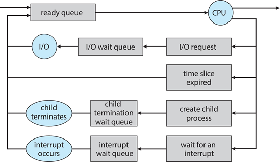

# Chapter 3: Processes

**Process Concept**

- OS는 프로세스로 실행되는 다양한 프로그램을 실행함

- Process 프로세스: 실행중인 프로그램

  -  프로세스 실행은 순차적 방식으로 진행됨
  - 단일 프로세스의 명령어가 병렬로 실행되지 않음

- 구성 요소

  

  - Program Code(text section)
  - Program Counter, processor registers 
    - 현재 상태(진행 상황) 저장
  - Stack
    - 일시적인 데이터를 저장
    - 함수 파라미터, 반환 주소, 지역 변수 등
  - Data section
    - 전역 변수 저장
  - Heap
    - 런타임 도중 동적으로 메모리 할당

- Program: 디스크에 저장된 **passive** entity(Executable file)

  - 프로그램은 여러 방법으로 실행가능함 gui, cli 등
  - 하나의 프로그램으로 여러개의 프로세스를 만들수 있음
    - 동일 프로그램을 실행하는 유저들을 고려해서 만들어야함

- Process: **active** entity

**Process State**

- New:  The process is **being created**
- Running:  Instructions are **being executed**
- Waiting:  The process is **waiting for some event to occur**
- Ready:  The process is **waiting to be assigned to a processor**
- Terminated:  The process **has finished** execution

**Process Control Block (PCB)**

- 각 프로세스와 관련된 정보가 들어있음

- Task control block 이라고도 함

- 

  

  - Process state – running, waiting, etc.
  - Program counter – 다음 실행할 instruction의 위치를 가리킴
  - CPU registers – contents of all process-centric registers
  - CPU scheduling information- 우선순위, scheduling queue pointers
  - Memory-management information – 프로세스에 할당된 메모리
  - Accounting information – CPU 사용 유무, 시작 이후 경과 시간, 시간 제한
  - I/O status information – 프로세스에 할당된 i/o 장치나 열려있는(사용하는) 파일 목록

**Threads**

- 프로세스마다 PC를 여러개 갖게 되면 코드의 여러 부분을 동시에 실행할수 있음
- 스레드의 세부정보를 저장하는 저장소와 여러 PC가 PCB 안에 있어야함

**Process Scheduling**

- CPU core가 실행할 프로세스를 선택함

- CPU 사용을 극대화하고 프로세스를 CPU core로 빠르게 전환(switch)함

- 프로세스의 스케줄링 대기열(queue)을 유지함

  - Ready queue – main memory에 상주하고 있는 모든 프로세스(ready and waiting to execute)
  - Wait queues – 이벤트를 기다리는 프로세스 (i.e., I/O)
  - 프로세스들은 다양한 대기열 사이를 오감

  

**Context Switch**

- CPU가 프로세스를 전환될 때 발생
- 전환되면 시스템은 이전 프로세스의 상태를 저장하고 새 프로세스에 대해 저장된 상태를 로드해야 함
  - 이전 프로세스 저장: 다음 전환시 사용하기 위함
- 프로세스의 Context는 PCB에 저장됨
- Context-switch time(컨텍스트 전환 시간)은 pure한 오버헤드임
  - 전환 중에 시스템이 유용한 작업을 수행하지 않음
  - OS와 PCB가 복잡할수록 길어짐
- 시간은 하드웨어 지원에 의존함
  - 일부 하드웨어는 CPU당 여러 레지스터 집합을 제공함 -> 여러 컨텍스트가 한번에 로드됨

**Multitasking in Mobile Systems**

- 일부 모바일 시스템은 하나의 프로세스만 실행할 수 있게 만듦
- screen real estate(디스플레이에서 사용할수 있는 화면 공간)때문에 제한함
  - iOS
    - single foreground process
    - multiple background processes: 디스플레이에 보이진 않지만 실행함
      - Limits include single, short task, receiving notification of events, specific long-running tasks like audio playback
  - android
    - iOS 보다 제약이 적음
      - 백그라운드 프로세스는 작업을 수행하기 위해 서비스를 사용함 
      - 백그라운드 프로세스가 일시 중단된 경우에도 서비스를 계속 실행할 수 있음
      - 서비스에 사용자 인터페이스가 없으며 메모리 사용량이 적음

**Operations on Processes**

- 시스템은 프로세스 생성과 종료의 메커니즘을 제공함

**Process Creation**

- 상위 프로세스는 하위 프로세스를 생성함 => 트리구조

-  프로세스 식별자(pid)를 통해 프로세스를 식별하고 관리함

- Resource sharing options(리소스 공유 옵션)

  - 상위 및 하위 프로세스가 모든 리소스를 공유함
  - 하위 프로세스가 상위 프로세스의 자원의 일부를 공유함
  - 상위 및 하위 프로세스끼리 공유 리소스 없음

- Execution options 실행 옵션

  - 상위 및 하위 프로세스를 동시 실행
  - 상위 프로세스는 하위 프로세스가 종료될 때까지 기다림

- Address space

  - 하위 프로세스는 상위 프로세스를 복제함
  - 하위 프로세스에 프로그램이 로드됨

- UNIX examples

  

  - `fork()` system call creates new process
  - `exec()` system call used after a `fork()` to replace the process' memory space with a new program
  - Parent process calls `wait()` waiting for the child to terminate

**Process Termination**

- 프로세스는 마지막 명령어(statement)를 실행한 다음 `exit()` 시스템 호출을 사용하여 삭제함
  - 운영 체제에 삭제하도록 요청
  - `wait()`을 통해 상태 데이터를 하위에서 상위 프로세스로 반환함
  - 프로세스 자원은 운영 체제에 의해 할당 해제(deallocated)됨
- 상위 프로세스는 `abort()`  시스템 콜을 사용해서 하위 프로세스의 실행을 종료할 수 있음
  - 하위 프로세스가 할당된 리소스를 초과한 경우
  - 하위 프로세스에 할당된 작업이 더 이상 필요하지 않은 경우
  - 상위 프로세스가 종료되고 있고, 운영 체제에서 상위 프로세스가 종료된 이후에 하위 프로세스 진행을 허용하지 않은 경우
- 일부 운영 체제는 상위 항목이 종료된 경우 하위 항목이 존재하도록 허용하지 않음
  - 프로세스가 종료되면 프로세스의 모든 하위 항목도 종료되어야 함
  - **cascading termination**: 연결된 모든 자손들을 순서대로 종료
  - OS에 의해 종료 시작
- 상위 프로세스는 `wait()`시스템 콜을 사용하여 하위 프로세스의 종료를 기다릴 수 있음
  - 호출은 종료된 프로세스의 상태 정보와 pid를 반환함
  - ` pid = wait(&status); `
- zombie process: 부모가 기다리지 않음
  - did not invoke `wait()`
- orphan process: 부모가 기다리지 않고 종료됨

**Android Process Importance Hierarchy**

- 모바일 운영 체제는 메모리와 같은 시스템 자원을 회수하기 위해 프로세스를 종료해야 하는 경우가 많음
- 안드로이드는 가장 중요하지 않은 프로세스(아래)부터 종료
  - 포그라운드 프로세스
  - 가시공정
  - 서비스 프로세스
  - 백그라운드 프로세스
  - 빈 프로세스

**Multiprocess Architecture – Chrome Browser**

- 많은 웹 브라우저가 단일 프로세스로 실행됨
  - 한 웹 사이트가 문제를 일으키면 전체 브라우저가 중단되거나 충돌할 수 있으므로 이를 방지하기 위해
- 3가지 유형의 프로세스
  - Browser process: 사용자 인터페이스, 디스크 및 네트워크 I/O 관리
  - Renderer process:  웹 페이지를 렌더링하고 HTML, 자바스크립트를 처리
    - 각 웹 사이트가 열릴때마다 새로운 렌더러가 생김
    - 디스크 및 네트워크 I/O를 제한하는 샌드박스에서 실행되어 보안 악용의 영향을 최소화함
  - Plug-in process: 각 플로그인을 위한 프로세스

**Interprocess Communication**

- 시스템 내의 프로세스는 독립적(Independent)이거나 협력적(cooperating)일 수 있음

- Cooperating process는 다른 프로세스에 영향을 주고 받음. ex) 데이터 공유

- 협력 프로세스를 사용하는 이유

  - Information sharing 정보 공유
  - Computation speedup 계산 속도 향상
  - Modularity 모듈성
  - Convenience 편리함

- 협력 프로세스에는 프로세스 간 커뮤니케이션(IPC, interprocess Communication) 필요

- IPC 모델

  

  - 공유 메모리(Shared memory)
  - 메시지 전달(Message passing)

**Producer-Consumer Problem**

- 협력 프로세스 패러다임:
  - Producer process는 정보를 생산함. Consumer process 는 생산된 정보를 사용함
- 두 가지 변형:
  - Unbounded-buffer: 버퍼 크기에 실질적인 제한을 두지 않음
    - Producer never waits
    - Consumer waits if there is no buffer to consume
  - bounded-buffer: 버퍼 크기가 고정됨
    - Producer must wait if all buffers are full
    - Consumer waits if there is no buffer to consume

**IPC in Shared-Memory Systems**

- 통신을 원하는 프로세스 사이에 공유되는 메모리 영역
- 유저 프로세스가 이를 통제함(OS가 통제하지 않음)
- 사용자 프로세스가 공유 메모리에 액세스할 때 동작을 동기화할 수 있는 메커니즘을 제공해야함
  - Race condition

**IPC in Message-Passing Systems**

- Shared variable 에 의존하지 않고 통신
- IPC facility provides two operations:
  - `send(message)`
  - `receive(message)`
- 메시지 크기는 고정되어있거나 가변적임
- 프로세스 간 통신하려면
  - 통신할수 있는 링크를 설정해야함
  - send, receive를 통해 메시지를 교환함
- 구현 할 때 issue
  - 프로세스간 링크 설정 방법
  - 링크에 연결되는 프로세스 수
  - 프로세스 쌍(pair) 사이에 최대 링크 수
  - 링크 용량(capacity) - 보낼수 있는 용량
  - 메시지 크기 - 고정, 가변
  - 링크 방향 - 단방향, 양방향

**Implementation of Communication Link**

- Physical:
  - 공유 메모리
  - 하드웨어 버스
  - 네트워크
- Logical:
  - 직접 또는 간접(Direct or indirect)
  - 동기식 또는 비동기식(Synchronous or asynchronous)
  - 자동 또는 명시적 버퍼링(Automatic or explicit buffering)

**Direct Communication**

- 프로세스는 통신하려는 프로세스의 이름을 명시적으로 지정해야함
  - `send(P, message)` – send a message to process P
  - `receive(Q, message)` – receive a message from process Q
- Comm. link 속성
  - 링크가 자동으로 설정됨
  - 링크는 정확히 한 쌍의 통신 프로세스와 연결됨
  - 각 쌍 사이에는 정확히 하나의 링크가 존재함
  - 링크는 단방향일 수 있지만 일반적으로 양방향

**Indirect Communication**

- 메시지는 mailbox (혹은 port)에서 수신됨

  - 모든 mailbox에는 고유한 ID가 있음
  - mailbox를 공유하는 프로세스만 통신할 수 있음

- Comm. link 속성

  - 프로세스가 공통 편지함을 공유하는 경우에만 링크가 설정됨
  - 링크는 여러 프로세스와 연결될 수 있음
  - 각 프로세스 쌍은 여러 통신 링크를 공유할 수 있음
  - 링크는 단방향 또는 양방향일 수 있음

- Operations

  - Create a new mailbox (port)
  - Send and receive messages through mailbox
  - Delete a mailbox

- Primitives

  - `send(A, message)` – send a message to mailbox A
  - `receive(A, message)` – receive a message from mailbox A

- Mailbox sharing

  - P1, P2 및 P3은 mailbox A를 공유함.

  - P1, 전송; P2 및 P3 수신

    => 수신 프로세스가 P2인지 P3인지 모름

  - 해결책

    - 링크를 최대 두 개의 프로세스와 연결
    - 한 번에 하나의 프로세스만 허용하여 수신 작업 실행
    - 수신자가 누구인지 발신자에게 알림

**Synchronization**

- Message passing 은 blocking 방식과 non-blocking 방식이 있음
- Blocking is considered synchronous
  - Blocking send - 보낸 메시지를 수신할 때까지 프로세스가 block
  - Blocking receive - 메시지를 사용할 수 있을 때까지 프로세스가 block
- Non-blocking is considered asynchronous
  - Non-blocking send - 메세지를 보내고 프로세스를 계속 진행함
  - Non-blocking receive - 메시지를 항상 받음 (valid message, null message)
- 송수신 방식은 서로 조합이 가능함
  - If both send and receive are blocking, we have a **rendezvous**
    - 동기화하는 동안 두 프로세스 가 단일 데이터를 교환 할 수 있도록 하는 시스템 콜

**Buffering**

- 링크에 있는 메시지 큐

- 세 가지 타입

  - Zero Capacity – 링크에 메시지가 대기하지 않습니다. 송신 프로세스는 수신 프로세스를 기다려야 함

  - Bounded Capacity – 한정된 길이의 n개 메시지. 링크가 꽉 찬 경우 송신 프로세스는 기다려야 함
  - Unbounded Capacity – 무한 길이. 송신 프로세스는 기다리지 않음.

**Pipes**

- 프로세스간에 통신할수 있는 통로
- Issue
  - 단방향, 양방향
  - 양방향인 경우 half duplex(무전기 방식), full duplex(일반 통화 방식)
  - 통신 프로세스 사이에 관계가 존재하는지 (부모-자식)
  - 네트워크를 통해 파이프를 사용할 수 있는지
- Ordinary pipes
  - 파이프를 만든 프로세스 외부에서 액세스할 수 없음
  - 상위 프로세스가 파이프를 생성하고, 하위 프로세스와 통신하는 데 사용함
- Named pipes
  - 상위-하위 관계 없이 액세스 가능

**Ordinary pipes**

- Ordinary Pipes allow communication in standard producer-consumer style

- 단방향

  

  - Producer writes to one end (the write-end of the pipe)
  - Consumer reads from the other end (the read-end of the pipe)

- 통신 프로세스 간의 상위-하위 관계 필요

- Windows는 **anonymous pipes**를 호출함

**Named pipes**

- Named Pipes are more powerful than ordinary pipes
- 양방향
- 통신 프로세스 간에 상위-하위 관계가 필요하지 않음
- 여러 프로세스가 통신에 사용할 수 있음
- UNIX 및 Windows 시스템 모두에서 제공

**Communications in Client-Server Systems**

- Sockets
- Remote Procedure Calls

**Sockets**

- 소켓은 통신을 위한 끝점(endpoint)으로 정의됨.
- Concatenation of IP address and port
  - port: 호스트의 네트워크 서비스를 구별하기 위해 메시지 패킷 시작 시 포함된 숫자
  - The socket 161.25.19.8:1625 - port 1625 on host 161.25.19.8
- 통신은 한 쌍의 소켓 사이에서 이루어짐.
- 1024 미만의 모든 포트는 잘 알려져 있으며 표준 서비스에 사용됨
- 프로세스가 실행 중인 시스템을 참조하는 특수 IP 주소 127.0.0.1(loopback)
  - localhost

**Sockets in Java**

- Three types of sockets
  - Connection-oriented (TCP)
  - Connectionless (UDP)
  - MulticastSocket class– data can be sent to multiple recipients

**Remote Procedure Calls** 

- 원격 프로시저 호출(RPC)은 네트워크 시스템의 프로세스 간 프로시저 호출을 추상화함
  - 서비스 차별화를 위해 포트를 다시 사용
- Stubs - 서버의 실제 프로시저를 위한 클라이언트측 프록시
- The client-side stub locates the server and **marshalls** the parameters 
  - 마샬링
    - 복잡한 통신을 단순화하여 쉽게 데이터를 주고받을 수 있도록 해주는 것
    - 한 객체의 메모리에서의 표현방식을 저장 또한 전송에 적합한 다른 데이터 형식으로 변환하는 과정
- The server-side stub receives this message, unpacks the marshalled parameters, and performs the procedure on the server
  - 변환된 데이터를 다시 사용할수 있게 해체(unpack)함
- On Windows, stub code compile from specification written in Microsoft Interface Definition Language (MIDL)
- 데이터 표현은 XDL(External Data Representation) 포맷으로 다뤄짐.
  - Big-endian and little-endian
- 원격 통신에 로컬 통신보다 장애 시나리오가 더 많음
  - 메시지는 exactly once로 전달될 수 있음. at most once 보다
    - at most once: Sender 는 메세지를 한 번만 전송하고 Receiver 가 받았는지 안받았는지 관심이 없다. 지연, 유실 모두 발생할 수 있으면 꼭 메세지를 받지 않아도 되는 경우에 사용할 수 있다.
    - exactly once: 정확하게 중복없이 메세지를 한 번만 전달하는 방식으로, 메세지 필터링 해주는 Middleware 가 존재한다. At-least-once Delivery 처럼 메세지를 전송하지만 Middleware 가 메세지의 ID 를 저장해서 중복되지 않은 값만 전송한다.
    - at least once: 최소한 한 번 메세지 전송 보장으로 Sender 가 메세지를 전송하고 일정 시간 내에 Receiver 에게 ACK 를 받지 못하면 다시 메세지를 전송하는 방식이다.
- OS는 일반적으로 클라이언트와 서버를 연결하기 위한 rendezvous(랑데부) (or **matchmaker**) 서비스 제공

**Execution of RPC**

