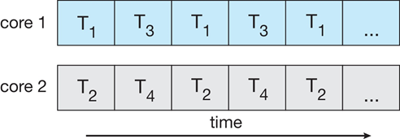
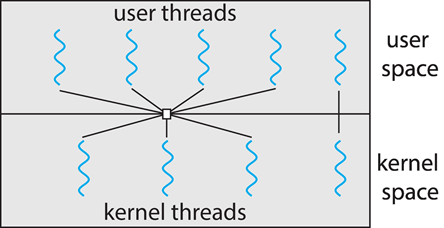

# Chapter 4: Threads & Concurrency

**Overview**

- 대부분의 최신 애플리케이션은 멀티스레드임
- 스레드는 응용프로그램 내에서 실행됨
- 애플리케이션으로 여러 작업을 별도의 스레드로 구현할 수 있습니다.
  - 표시 업데이트
  - 데이터 가져오기
  - 철자 검사
  - 네트워크 요청에 응답
- 프로세스 생성은 무겁지만(heavy-weight), 스레드 생성은 가벼움(light-weight)
- 스레드를 사용하면 코드를 단순화하고 효율성을 높일 수 있음
- 커널은 일반적으로 멀티스레드임


**Single and Multi-threaded Processes**


**Multi-threaded Server Architecture**


**Benefits**

- Responsiveness 대응성
  - 프로세스의 일부가 차단된 경우 스레드를 통해 계속 실행할 수 있음.
  - 사용자 인터페이스에 특히 중요함
- Resource Sharing 리소스 공유
  - shared memory나 message passing 보다 더 쉽게 프로세스 자원을 공유함
- Economy 경제성
  - 프로세스 생성보다 저렴함
  - 컨텍스트 전환보다 스레드 전환 오버헤드가 적음
- Scalability 확장성
  - 프로세스가 멀티코어 아키텍처를 활용할 수 있음


**Multi-core Programming**

- Multicore or multiprocessor systems은 프로그래머가 다음을 구현해야함

  - Dividing activities

  - Balance

  - Data splitting

  - Data dependency

  - Testing and debugging

- Parallelism 병렬화

  - 시스템이 둘 이상의 작업을 동시에 수행할 수 있음(물리적 개념)

- Concurrency 동시성

  - 둘 이상의 작업을 진행함(논리적 개념)
  - 단일 프로세서, 코어에서 스케줄러가 동시성을 제공

  

  

- Types of parallelism 

  

  - Data parallelism
    - 일한 데이터의 하위 집합을 여러 코어에 분산하고 각각에 대해 동일한 작업을 수행함
  - Task parallelism
    - 코어 전체에 스레드를 분산하고 각 스레드가 고유한 작업을 수행합니다.


**Amdahl’s Law**

- 컴퓨터 시스템의 일부를 개선할 때 전체적으로 얼마만큼의 최대 성능 향상이 있는지 계산하는 데 사용
- 병렬 컴퓨팅을 할 경우, 일부 병렬화 가능한 작업들은 사실상 계산에 참여하는 컴퓨터의 개수에 비례해서 속도가 늘어남.
  - 이러한 경우 암달의 법칙에 의해서 전체 수행시간의 개선 효과는 병렬화가 불가능한 작업들의 비중에 크게 영향을 받게 됨
  - 아무리 컴퓨터의 개수가 늘어나더라도 속도의 한계는 정해져있다는 것.


**User Threads and Kernel Threads**


- User threads
  - 사용자 수준 스레드 라이브러리로 관리
  - POSIX Pthreads
  - Windows threads
  - Java threads
- Kernel threads
  - 커널에서 지원
  - virtually all general-purpose operating systems 거의 모든 범용 운영 체제
    - Windows 
    - Linux
    - Mac OS X
    - iOS
    - Android


**Multi-threading Models**

- Many-to-One

  

- One-to-One

  

- Many-to-Many

  


**Many-to-One**

- **Many** user-level threads mapped **to** **single** kernel thread
- 하나의 thread blocking은 모든 스레드를 block 시킴
- multicore system에서 여러 스레드를 병렬로 실행할 수 없음
  - 한번에 하나의 커널에만 있을 수 있음
- 이 모델을 사용하는 시스템은 거의 없음


**One-to-One**

- **Each** user-level thread maps to kernel thread
- 유저 레벨 스레드를 생성하면 커널 스레드가 생성됨
- many-to-one 보다 많은 동시성
- 프로세스 당 스레드 수는 오버헤드에 의해 제한됨
- Ex) Windows, Linux


**Many-to-Many Model**

- Allows **many** user level threads to be mapped **to** **many** kernel threads
- 운영체제에서 충분한 수의 커널 스레드를 생성함
- 흔하진 않음
  - Windows with the ThreadFiber package


**Two-level Model**



- Many to Many 와 유사함
- 사용자 스레드가 커널 스레드에 바인딩 가능


**Thread Libraries**

- Thread library는 프로그래머에게 스레드 작성 및 관리를 위한 API를 제공합니다.
- 두 가지 주요 구현 방법
  - 라이브러리 전체가 사용자 공간에 있음
  - OS에서 지원하는 Kernel-level library


**Pthreads**

- user-level 이나 kernel-level 로 제공될수 있음
- 스레드 생성 및 동기화를 위한 POSIX 표준(IEEE 1003.1c) API
- 사양, 구현이 아님
- API는 스레드 라이브러리의 동작을 지정하며, 구현은 라이브러리 개발에 달려 있음
- UNIX operating systems 에서 흔함(Linux & Mac OS X)


**Implicit Threading** 암시적 스레딩

- 스레드 수가 증가함에 따라 명시적 스레드로는 프로그램 정확성이 더욱 어려워짐
- 컴파일러 및 런타임 라이브러리에 의해 스레드 작성 및 관리를 수행함. 프로그래머가 직접 수행하지 않음
- Five methods explored
  - Thread Pools
  - Fork-Join
  - OpenMP
  - Grand Central Dispatch
  - Intel Threading Building Blocks


**Thread Pools**

- 작업이 대기 중인 풀에 여러 개의 스레드 생성
- 장점:
  - 새로운 스레드를 만드는 것보다 기존 스레드로 요청을 처리하는게 빠름
  - 응용 프로그램의 스레드 수를 풀 크기에 바인딩할 수 있음
  - 수행할 작업을 작업 생성 메커니즘과 분리하여 작업 실행 전략을 달리할 수 있음
    - 작업이 주기적으로 실행되도록 예약할 수 있음


**Fork-Join Parallelism**


- Multiple threads (tasks) are **forked**, and then **joined**.


**OpenMP**

- Set of compiler directives and an API for C, C++, FORTRAN 
- 공유 메모리 환경에서 병렬 프로그래밍 지원
- Identifies parallel regions(병렬 영역 식별)
  - parallel regions: 병렬로 실행할 수 있는 코드 블록
  - `#pragma omp parallel `
- 코어 수만큼 스레드 생성 가능


**Grand Central Dispatch**

- MacOS 및 iOS 운영 체제를 위한 Apple 기술

- Extensions to C, C++ and Objective-C languages, API, and run-time library

- parallel sections을 식별할수 있음

- 스레딩에 대한 대부분의 세부 정보를 관리함

- block은 Dispatch queue에 위치함

  - queue에서 제거될 때 thread pool의 사용 가능한 스레드에 할당됨

- Two types of dispatch queues:

  - serial – blocks removed in FIFO order, queue is per process, called **main queue**

    - 프로그램 내에 추가적인 대기열을 만들수 있음

  - concurrent – removed in FIFO order, 한 번에 여러개를 제거할 수 있음

    - Four system wide queues divided by quality of service:

      `QOS_CLASS_USER_INTERACTIVE`

      `QOS_CLASS_USER_INITIATED`

      `QOS_CLASS_USER_UTILITY`

      `QOS_CLASS_USER_BACKGROUND`


**Intel Threading Building Blocks** (TBB)

- 병렬 프로그램 설계를 위한 C++ 템플릿 라이브러리

- 단순 for 반복문

  ```c++
  for (int i = 0; i < n; i++) apply(v[i]);

- TBB를 사용하여 작성된 반복문

  ```c++
  parallel_for (size_t(0), n, [=](size_t i) {apply(v[i]);});
  ```

  

**Threading Issues**

- Semantics of `fork()` and `exec()` system calls
- Signal handling 신호 처리
  - Synchronous and asynchronous

- Thread cancellation of target thread 타겟 스레드의 스레드 취소
  - Asynchronous or deferred 비동기 또는 지연

- Thread-local storage
- Scheduler Activations 스케줄러 활성화


**Semantics of `fork()` and `exec()` system calls**

- `fork()`: 호출한 스레드만 복제 or 모든 스레드 복제
  - 대부분의 UNIX 시스템은 두가지 버전의 복제를 지원함
- `exec()`: 모든 스레드를 포함해서 실행중인 프로세스를 교체함


**Signal handling**

- UNIX 시스템에서 Signal은 프로세스에 특정 이벤트가 발생했음을 알리는 데 사용됨

- Signal handler는 Signal(신호)을 처리하는 데 사용됨

  - 특정 이벤트에 의해 신호가 생성됨
  - 신호가 프로세스에 전달됨
  - 신호는 두 개의 신호 핸들러 중 하나에 의해 처리됨
    - default
    - user-defined

- 모든 신호에는 default handler가 있음

  - default handler는 커널이 신호를 처리할 때 실행됨
  - user-defined signal handler는 default handler를 재정의할 수 있음
  - 단일 스레드에선 프로세스 차원에서 시그널을 처리함

- 멀티 스레드에서의 신호 처리

  - Deliver the signal **to the thread to which the signal applies**

    시그널을 적용하는 스레드에게 전달

  - Deliver the signal **to every thread in the process**

    모든 스레드에 전달

  - Deliver the signal **to certain threads in the process**

    몇몇 스레드에게만 선택적으로 전달

  - Assign **a specific thread to receive all signals** for the process

    특정 스레드가 모든 신호를 전달 받도록 지정


**Thread Cancellation**

- 스레드가 완료되기 전에 종료

- Target Thread: 취소할 스레드

- 일반적인 접근 방식

  - Asynchronous cancellation은 즉시  target thread를 종료함
  - Deferred cancellation은 target thread가 주기적으로 취소 했는지 확인함
    - 작업 확인 마무리 후 종료

- thread cancellation은 thread의 상태에 따라 취소를 결정함

  

  - Disabled 인 경우, 스레드가 사용 가능으로 설정될 때까지 취소 보류 상태로 남음
  - Default type은 deferred 
    - 취소는 스레드가 취소 지점에 도달할 때만 발생
    - 그 다음 cleanup handler 호출


**Thread-local storage**

- Thread-local storage(TLS)를 통해 각 스레드가 고유한 데이터 복사본을 가질 수 있음
- 스레드 생성 프로세스를 제어할 수 없는 경우 유용함 (예: 스레드 풀 사용)
- local variables(지역 변수)와 다름
  - single function invocation(단일 함수 호출) 중에만 지역 변수 표시
  - TLS visible across function invocations
- static data(정적 데이터)와 유사함
  - TLS는 각 스레드에 독립적임


**Scheduler Activations**

- many-to-many와 Two-level 모델 모두 통신이 필요함
  - 애플리케이션에 할당된 적절한 수의 커널 스레드를 유지하기 위해서
- lightweight process (LWP): 일반적으로 사용자와 커널 스레드 사이의 중간 데이터 구조를 사용함
  - 가상 프로세서로 나타남
    - 프로세스가 사용자 스레드를 실행하도록 예약할 수 있음
  - 커널 스레드에 연결된 각 LWP
- upcalls: 스케줄러 활성화를 위해 제공됨
  - 커널에서 upcall handler로의 통신 메커니즘
- 이 통신을 통해 응용 프로그램이 올바른 수의 커널 스레드를 유지할 수 있음


**Operating System Examples**

- Windows Threads

  - 스레드의 주요 데이터 구조

    

    - ETHREAD (executive thread block) 
      - includes pointer to process to which thread belongs and to KTHREAD, in kernel space
      - 커널 공간에 스레드가 속한 프로세스 및 KSREAD에 대한 포인터를 포함합니다.
    - KTHREAD (kernel thread block)
      - scheduling and synchronization info, kernel-mode stack, pointer to TEB, in kernel space
      - 스케줄링 및 동기화 정보, 커널 모드 스택, TEB에 대한 포인터, 커널 공간
    - TEB (thread environment block)
      - thread id, user-mode stack, thread-local storage, in user space
      - 사용자 공간의 스레드 ID, 사용자 모드 스택, 스레드 로컬 스토리지

- Linux Threads
  - thread 보다 task라고 부름
  - `clone()` system call을 통해 스레트 생성
  - `clone()` 를 통해 하위 태스크가 상위 태스크(프로세스)의 주소 공간을 공유할 수 있음
    - Flags control behavior
  - `struct task_struct`는 프로세스 데이터 구조(공유 또는 고유)를 가리킴

