# Chapter 5: CPU Scheduling

**Basic Concepts**

- CPU 스케줄링은 멀티프로그래밍으로 CPU 사용을 최대한으로 높이는 작업임

- CPU–I/O Burst Cycle 

  - 프로세스 실행은 CPU 실행 사이클과 I/O 대기 사이클로 구성됨

  - CPU burst: cpu를 오랫동안 사용하는 작업

  - I/O burst: I/O를 오랫동안 사용하는 작업

    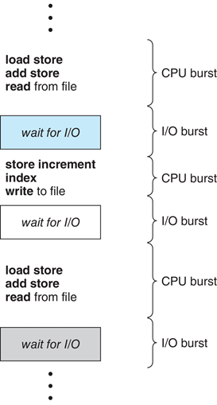

- CPU burst 이후 I/O burst 발생

- CPU burst 분포가 중요함

  - cpu를 오랫동안 사용하는 작업이 많을수록 cpu 사용을 최대한으로 높일수 있음

**Histogram of CPU-burst Times**

- 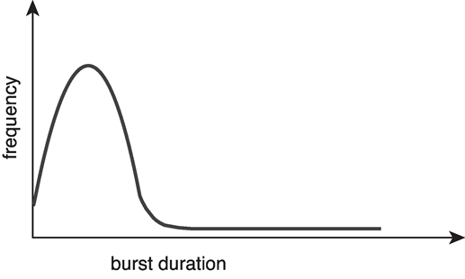

- Large number of short bursts
  - I/O burst는 빈도가 높음
- Small number of longer bursts(CPU burst)
  - CPU burst는 빈도가 적음 
- 빈도에 따라 스케줄링을 하게 되면 I/O 작업에 우선적으로 할당을 함
  - CPU 사용량이 작아지므로 스케줄링 필요

**CPU Scheduler**

- CPU 스케줄러는 ready queue의 프로세스 중에서 선택하고, CPU 코어를 할당함
  - 다양한 방법으로 대기열을 정렬할 수 있음
- CPU 스케줄링은 다음과 같은 경우에 결정됨
  1. 프로세스 상태가 running 에서 waiting 으로 전환할 때
  2. 프로세스 상태가 running 에서 ready 로 전환할 때
  3. 프로세스 상태가 waiting 에서 ready 로 전환할 때
  4. 프로세스가 종료될 때
- 1, 4의 경우 스케줄링을 할 필요가 없음
  - ready queue에 있는 프로세스를 선택하여 실행함
- 2, 3의 경우 스케줄링 필요

**Preemptive and Nonpreemptive Scheduling**

- **nonpreemptive**: 
  - 1, 4의 경우, 진행이 끝날때까지 기다림
  - CPU가 프로세스에 할당되면 프로세스는 종료 또는 대기 상태로 전환하여 CPU를 해제할 때까지 CPU를 유지함
- **preemptive**: 
  - 2, 3의 경우, 다른 프로세스로 넘겨주어야함.
  - Windows, MacOS, Linux, UNIX, etc
  - 데이터가 공유되는 상황에서 race condition 발생할수 있음
    - 같은 데이터를 사용하려고 하면 막아야함

**Dispatcher**

- 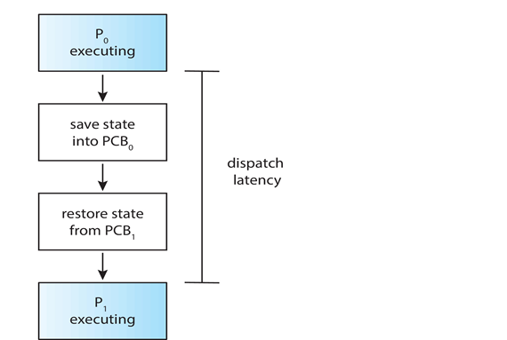

- Dispatcher module 은 CPU 스케줄러가 선택한 프로세스에게  CPU의 제어권을 부여함
  - Switching context
  - Switching to user mode
  - Jumping to the proper location in the user program to restart that program
    프로그램을 재시작하기위해 유저 프로그램의 적절한 위치로 이동(jumping)
- Dispatch latency
  - dispatcher가 한 프로세스를 중지하고 다른 프로세스를 실행하는데 걸리는 시간

**Scheduling Criteria** 

- CPU utilization – CPU 사용률을 유지함
- Throughput – 시간 단위당 실행을 완료하는 프로세스 수
- Turnaround time – 특정 프로세스를 실행하는 데 걸리는 시간
- Waiting time – 프로세스가 ready queue에서 대기한 시간
- Response time – 요청이 제출된 시점부터 첫 번째 응답이 생성될 때까지 걸리는 시간

- **Scheduling Algorithm Optimization Criteria**

  - Max CPU utilization

  - Max throughput

  - Min turnaround time 

  - Min waiting time 

  - Min response time

**Scheduling Algorithms**

- First- Come, First-Served (FCFS) Scheduling

- Shortest-Job-First (SJF) Scheduling
- Round Robin (RR)
- Priority Scheduling

**First- Come, First-Served (FCFS) Scheduling**

- 처음 들어오는 프로세스를 먼저 처리함
- convoy effect(후위 효과)
  - 짧은 시간의 프로세스가 긴 시간의 프로세스때문에 오래 기다리는 상황
  - ex. 하나의 CPU-bound 프로세스(cpu-burst)와 많은 I/O bound 프로세스가 있는 상황

**Shortest-Job-First (SJF) Scheduling**

- 다음 프로세스의 시간을 확인해서 가장 짧은 프로세스를 먼저 처리함

- Preemptive version

  - SJF의 변형: 잔여 실행 시간이 더 적은 프로세스가 ready 상태가 되면 프로세스 바꿈
  - **shortest-remaining-time-first**(SRJF; shortest remaining job first)

- SJF가 최적(optimal)임

  - 주어진 프로세스 집합에 대한 최소 평균 대기 시간 제공
  - 하지만 다음 CPU burst의 길이를 알기 어려움
    - 추정해서 사용하거나 사용자에게 물어봐야함

- Determining Length of Next CPU Burst

  - 이전과 비슷한 프로세스의 길이를 사용해서 예측하는 방법

    - CPU burst가 가장 짧은 프로세스를 선택함

  - 이전 CPU burst 길이를 사용해서 지수 평균으로 예측하는 방법

    - 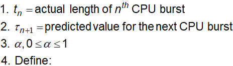

      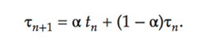

      일반적으로 a(alpha) = 1/2를 사용함

- 단점

  - starvation: 한 프로세스보다 짧은 프로세스가 계속 들어오는 경우 무한정 기다리게 됨

**Round Robin (RR)**

- 시간 단위로 CPU를 할당하는 방식

  - 각 프로세스에 작은 CPU 시간 단위 설정(시간 단위, 시간 퀀텀 q, 10-100 밀리초)하고, 해당 시간동안 프로세스를 실행함. 시간이 지나면  ready queue의 끝에 추가됨
  - ready queue에 프로세스가 n개 있고 퀀텀 시간이 q이면, 각 프로세스는 CPU 시간의 1/n을 최대 q 시간 단위로 한 번에 가져옴
  - (n-1) * q 시간 단위를 초과하는 대기 프로세스가 없음
  - 타이머가 다음 프로세스를 스케줄링하기 위해 모든 퀀텀을 중단(interrupt)함

- Performance

  - q large => FIFO 선입 선출이랑 큰 차이 없음

  - q small => 너무 작으면 context switch에 의한 overhead가 너무 커짐. q가 적당히 커야함

    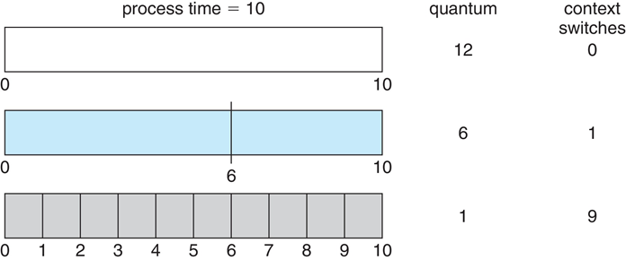

  - 보통 10 ~ 100 ms

**Priority Scheduling**

- 프로세스마다 우선순위를 정해서 스케줄링 하는 방식
  - CPU는 가장 높은 우선 순위를 가진 프로세스에 할당됨
  - Preemptive 방식
  - Nonpreemptive 방식
- SJF도  priority scheduling의 하나
  - SJF의 우선순위는 예측된 next CPU burst time의 역수(시간이 짧은 순)
- 문제점
  - starvation(기아): 우선순위가 낮은 프로세스가 실행되지 않을 수 있음
- 해결방법
  - aging(노화): 시간이 흐르면 프로세스의 우선순위를 증가시킴
- Round Robin 알고리즘에 우선순위를 정해서 사용할수 있음
  - 가장 높은 우선순위로 프로세스를 실행하고, 우선순위가 동일하다면 라운드 로빈 실행

**Multilevel Queue**

- priority scheduling에서 각 우선 순위에 대한 별도의 queue가 있어야 함

  - 우선순위 마다 따로 대기함
  - multilevel queue를 사용해서 가장 우선순위가 높은 대기열부터 진행
  - 우선순위가 높은 queue에 프로세스가 없으면 그 다음 높은순위의 queue 실행

- 프로세스 유형에 따라서도 우선순위를 지정할수 있음

  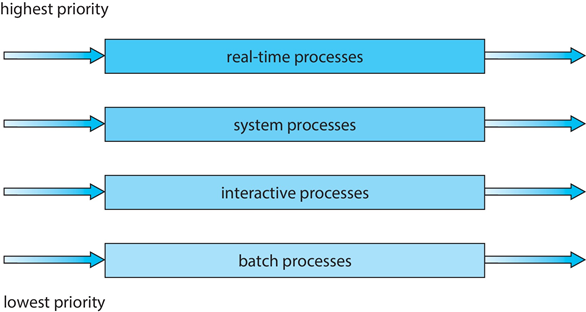

**Multilevel Feedback Queue**

- 프로세스는 다양한 대기열 사이를 이동할 수 있음

  - 우선순위 변동 가능

- Multilevel-feedback-queue 스케줄러 구성요소

  - 여러 개의 queue
  - 각 queue에 대한 스케줄링 알고리즘
  - 프로세스의 우선순위를 올릴 때 사용되는 방법
  - 프로세스의 우선순위를 내릴 때 사용되는 방법
  - 프로세스가 들어갈 queue를 결정하는 방법

- Aging은 multilevel feedback queue로 구현할 수 있음

- Example

  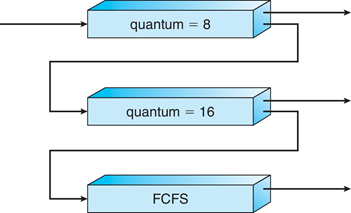

  - Scheduling algorithm
    - 새 프로세스는 Q0 queue에 들어감. 해당 queue는 RR 사용
    - 8ms 내에 완료되지 않으면 프로세스가 Q1 queue로 이동
    - Q1에서도 q=16인 RR 사용
    - 그래도 완료되지 않으면 Q2 대기열로 이동

**Thread Scheduling**

- user-level and kernel-level threads의 구분

- 스레드가 지원되는 경우 프로세스 스케줄링이 스레드 스케줄링 사용

- Many-to-one and many-to-many models인 thread library 는 LWP에서 실행할 user-level thread를 스케줄링함

  - 스케줄링 경쟁(competition)이 프로세스 내에 있기 때문에 process-contention scope (PCS) 로 알려짐
  - 일반적으로 프로그래머가 설정한 우선 순위를 통해 수행됨

- 사용 가능한 CPU에 예약된 커널 스레드는  system-contention scope (SCS)임

  - 시스템 내 모든 스레드끼리 경쟁

  

**Pthread Scheduling**

- API를 사용하면 스레드를 생성하는 동안 PCS 또는 SCS 중 하나를 지정할 수 있음
  - PTHREAD_SCOPE_PROCESS은 PCS 스케줄링을 사용하여 스레드 예약
  - PTHREAD_SCOPE_SYSTEM은 SCS 스케줄링을 사용하여 스레드 예약
- OS로 제한 가능
  - Linux 및 macOS는 PTHREAD_SCOPE_SYSTEM만 허용

**Multi-Processor Scheduling**

- CPU를 여러 개 사용할 수 있는 경우 CPU 스케줄링이 더 복잡함

- 멀티프로세스 시스템 아키텍처 종류

  - Multicore CPUs
  - Multithreaded cores (Multithreaded Multicore)
  - NUMA systems
  - Heterogeneous multiprocessing

- Symmetric Multiprocessing(SMP)은 각 프로세서가 자체 스케줄링을 수행하는 곳임

  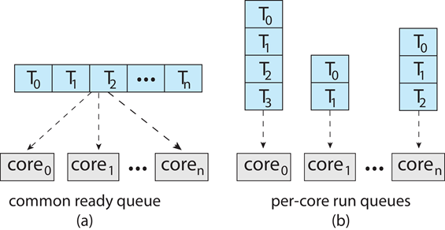

  - 모든 스레드는 common ready queue에 있을 수 있음 (a)
  - 각 프로세서는 private queue of thread(스레드 전용 큐)를 가질 수 있음 (b)

**Multicore Processors**

- 최근엔 동일한 물리적 칩에 여러개의 프로세서 코어를 배치함
- 속도가 더 빠르고 전력 소비가 적음
- 코어당 스레드 수 증가
  - 메모리 스톨(memory stall)을 활용하여 메모리 검색(memory retrieve)이 수행되는 동안 다른 스레드에서 진행
  - 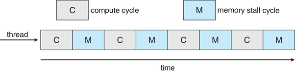

**Multithreaded Multicore System**

- 코어 마다 하나 이상의 하드웨어 스레드를 가짐

- 하나의 스레드에 메모리 스톨이 있으면  다른 스레드로 교체함

  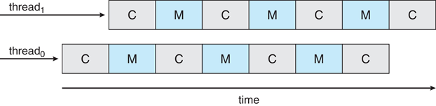

- 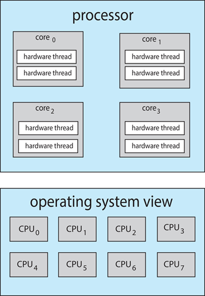

  - Chip-multithreading (CMT) 은 각 코어마다 여러 개의 하드웨어 스레드를 할당함
  - 쿼드 코어 시스템에서 코어당 2개씩 스레드가 있으면, OS는 8개의 논리 프로세서로 인식함

- 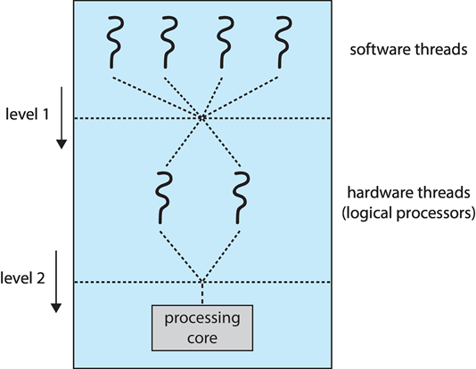

  Two levels of scheduling

  1. OS는 logical CPU에서 실행할 소프트웨어 스레드를 결정함

  2. 각 코어가 physical core에서 실행할 하드웨어 스레드를 결정함

- Load balancing

  - SMP(symmetric multiprocessing)이라면, 효율성을 위해 모든 CPU가 로드됨
  - Load balancing은 workload가 고르게 분산되도록 시도함
  - Push migration
    - 주기적으로 각 프로세서의 로드를 확인
    - 과부하된(overloaded) cpu가 있으면 그 작업(task)을 다른 cpu로 옮김
  - Pull migration
    - idle 프로세서가 busy 프로세서의 작업을 가져옴

- Processor Affinity 프로세서 선호도

  - 스레드가 지정된(원하는) CPU에서 프로그램이 동작하게 만듦
    - 이전에 스레드를 실행했던 프로세서로 스케줄링함
    - 스레드가 하나의 프로세서에서 실행되면 실행하고 남은 부분이 해당 프로세서의 캐시 메모리에 남아있을수 있음
    - 동일한 프로세서에서 실행할 인터럽트가 거의 없는 CPU 집약적인 프로세스를 예약하면 캐시 누락 과 같은 저하 이벤트를 줄여 성능을 향상시킬 수 있음
    -  일반 프로그램은 해당 CPU를 다시 사용할 수 있을 때까지 기다려야 하므로 속도가 느려질 수 있음
  - 로드 밸런싱은 프로세서 선호도에 영향을 미칠 수 있음
    - 스레드가 로드 밸런싱을 위해 한 프로세서에서 다른 프로세서로 강제로 이동시키기 때문임
  - 선호도 종류
    - Soft affinity – 운영 체제는 동일한 프로세서에서 스레드를 계속 실행하려고 하지만 보장되지 않음
    - Hard affinity – 프로세스가 실행될 수 있는 프로세서를 지정할 수 있음

**NUMA and CPU Scheduling**

- 운영 체제가 NUMA-aware인 경우, 스레드가 실행 중인 CPU에 가까운 메모리를 할당함
- NUMA: Non-Uniform Memory Access
  - 메모리에 접근하는 시간이 메모리와 프로세서간의 상대적인 위치에 따라 달라짐
  - 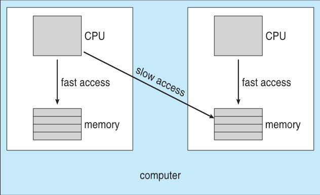

**Real-Time CPU Scheduling**

- 명백한 문제에 직면할수 있음(can present obvious challenges)

- Soft real-time systems

  - Critical real-time 작업은 높은 우선순위를 가지지만 예약 시기에 대한 보장이 없음

- Hard real-time systems

  - deadline까지 작업을 처리해야함

- Event latency

  - 이벤트가 발생한 시점부터 서비스될 때까지 경과된 시간

- 성능(performance)에 영향을 미치는 레이턴시 종류

  -  Interrupt latency: 인터럽트가 시작되고 다시 루틴으로 돌아갈때까지 시간

    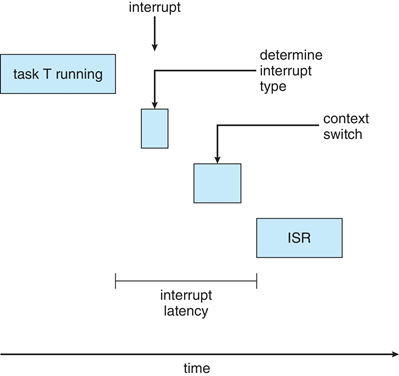

  -  Dispatch latency: CPU에서 현재 프로세스를 제거하고 다른 프로세스로 전환하는 시간

    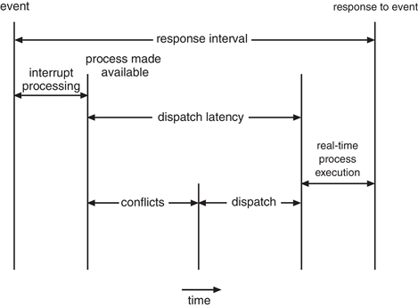

    - Conflict phase of dispatch latency:

      1. Preemption of any process running in kernel mode

         커널 모드에서 실행 중인 모든 프로세스의 선점

      2. Release by low-priority process of resources needed by high-priority processes

         우선순위가 높은 프로세스에 필요한 리소스를 우선순위가 낮은 프로세스로 배포

**Priority-based Scheduling**

- real-time scheduling은 preemptive, priority-based 스케줄링을 반드시 지원해야함

  - 하지만 soft real-time은 보장만 해줌

- hard real-time은 deadline을 맞출수 있는 능력도 제공해야함

- Processes have new characteristics: periodic ones require CPU at constant intervals

  periodic 한 것은 일정한 주기로 CPU를 요구함

  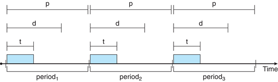

  - 0 ≤ t ≤ d ≤ p (p: period, d: deadline, t: time)
  - **Rate**: 단위 시간당 처리하는 횟수
    - Rate of periodic task is 1/p

**Rate Monotonic Scheduling**

- 우선순위는 period 의 역수(rate)를 기준으로 할당됨
  - Shorter periods = higher rates =  higher priority
  - Longer periods = lower rates = lower priority
  - 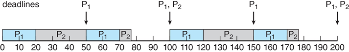
    - P1 is assigned a higher priority than P2.
- **Missed Deadlines with Rate Monotonic Scheduling**
  - 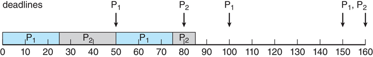

- **Earliest Deadline First Scheduling (EDF)**
  - deadlines이 빠를수록 높은 우선순위로 할당됨

**Proportional Share Scheduling** 비례 지분 스케줄링

- 시스템에 있는 모든 프로세스에 일정량의 CPU 시간 을 미리 할당함
  - 모든 작업에 가중치가 있어서 이 가중치에 비례하여 리소스를 공유받음
- T만큼 cpu시간을 사용하고 하나의 프로세스가 N(N < T)만큼을 사용할때, 각 프로세스는 전체 프로세서 시간의 N/T 만큼 차지함

**POSIX Real-Time Scheduling**

- **POSIX.1b**: Real-time extensions (IEEE Std 1003.1b-1993, later appearing as librt—the Realtime Extensions library)
- API는 실시간 스레드 관리 기능을 제공함
- 실시간 스레드를 위한 스케줄링 클래스
  - SCHED_FIFO: 스레드 스케줄링은 FIFO queue를 사용함(First Come First Schedule). 우선순위가 동일한 스레드에 대해서는 시간 분할이 없음
  - SCHED_RR: 우선순위가 동일 한 스레드에 round robin 적용. 그 외엔 SCHED_FIFO와 유사합니다.

**Operating Systems Examples**

- Linux scheduling
- Windows scheduling
- Solaris scheduling
- 예제여서 넘어가겠음

**Algorithm Evaluation**

- 스케줄링 알고리즘을 선택하는 방법

  - 기준을 결정한다음 알고리즘 평가

- Deterministic modeling

  - Type of analytic evaluation
  - 미리 결정된 특정 워크로드를 사용하고 해당 워크로드에 대한 각 알고리즘의 성능을 정의(defines)함

- **Deterministic Evaluation** 결정론적 평가

  - 각 알고리즘에 대해 평균 대기 시간의 최솟값을 계산
  - 간단하고 빠르지만 입력으로 정확한 숫자가 필요하며 해당 입력에만 적용됨.

- **Queueing Models**

  - 프로세스 도착(arrival of processes) 및 CPU 및 I/O burst 의 발생 가능성을 분석할 때 사용
    - Commonly exponential, and described by mean
    - average throughput 평균 처리량, utilization 활용률, waiting time 대기 시간  등을 계산함 
  - 대기 프로세스 대기열이 있는 서버 네트워크를 분석할 때 사용
    - arrival rates과 service rates을  파악할수 있음
    - utilization 활용률, average queue length 평균 대기열 길이, average wait time 평균 대기 시간 등을 계산함

- **Little’s Formula**

  - n = 평균 대기열 길이, W = 대기열의 평균 대기 시간, λ = 큐에 대한 평균 도착 속도
  - Little’s law 
    - 정상 상태(steady state)에서 큐를 떠나는 프로세스와 도착하는 프로세스는 반드시 같아야 함
    - n = λ * W
    - 모든 스케줄링 알고리즘 및 도착 분포(arrival distribution)에 유효함
  - 예를 들어, 평균 초당 7개의 프로세스가 도착하고 일반적으로 14개의 프로세스가 대기열에 있으면 프로세스당 평균 대기 시간은 2초임

- **Simulations**

  - Queueing models은 제한적임

  - Simulations more accurate. 시뮬레이션이 더 정확함

    - 컴퓨터 시스템의 프로그래밍된 모델
    - Clock is a variable
    - 알고리즘 성능을 나타내는 통계를 수집함

  - 시뮬레이션을 위한 데이터 수집 방법

    - 확률에 따른 난수 생성자(random)
    - 수학 또는 경험적으로 정의된 분포(distribution)
    - 실제 시스템의 실제 이벤트 시퀀스

  - **Evaluation of CPU Schedulers by Simulation**

    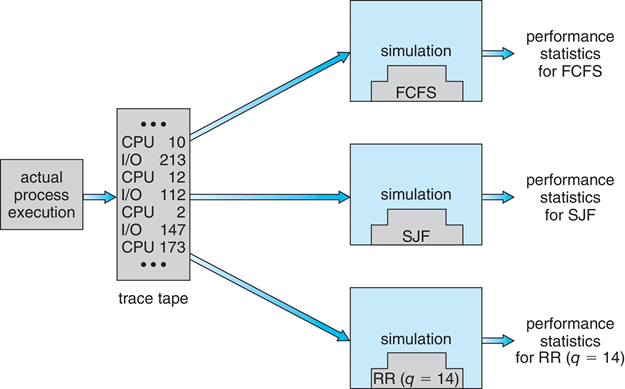

- **Implementation**

  - Even simulations have limited accuracy. 시뮬레이션도 제한적임
  - 실제 시스템에서 새로운 스케줄러를 구현하고 테스트하는 방식
    - High cost, high risk
    - Environments vary
  - 대부분의 유연한 스케줄러는 사이트, 시스템별로 수정할 수 있음
  - API가 우선순위를 수정할수 있음
  - But again environments vary
    - 대충 어렵다는 건가?

