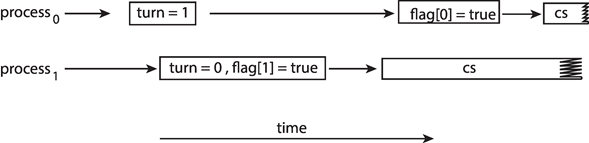

# Chapter 6: Synchronization Tools

**Background**

- 프로세스는 동시에 실행될수 있고 언제든 중단되어 부분적으로 실행 완료될 수 있음

- 공유 데이터(shared data)에 동시에 액세스 하는 경우 데이터 불일치가 발생할수 있음

  - ex) 메모리에 있는 데이터(`mem[0] = 1`)에 접근할 때, 한 프로세스는 `mem[0]+=1`을 실행하고 한 프로세스는 `mem[0]-=1`을 실행하는 경우 => 어떤 값 저장?

- 데이터 일관성을 유지하려면 협력 프로세스의 실행 순서를 보장하는 메커니즘이 필요함

- 병행으로 수행되는 여러 프로세스가 같은 데이터를 조작할때 race condition이 생김

- **race condition**

  

  - 동일한 변수에 액세스하는 것을 방지하는 메커니즘이 없다면 동일한 pid가 두 개의 다른 프로세스에 할당될 수 있음


**The Critical-Section Problem**

- 임계 구역(Critical Section):

  - 여러 개의 프로세스를 가지는 시스템에서 각 프로세스는 코드의 critical section segment를 가짐
  - critical프로세스는 공통 변수를 변경할수 있고, 테이블 업데이트, 파일 쓰기 등을 할수 있음
  - 한 프로세스가 critical section에 있을 때 다른 프로세스가 들어올수 없어야함(mutually exclusive)

- 각 프로세스는 critical section에 들어가기 위해 권한을 요청해야함

  - 진입 구역 entry section: 권한을 요청하는 코드
  - 출구 구역 exit section: critical section이 끝난 이후 다른 프로세스가 진입할수 있도록 만드는 코드

- 잔류 구역 remainder section: entry, critical, exit section을 제외한 코드

- 일반적인 구조

  - ```
    while (1) {
        // entry section
            // critical section
        // exit section
        
        // remainder section
    }
    ```

- 해결 메커니즘
  - 상호 배제(mutual exclusive): 한 프로세스가 critical section에서 실행하고 있으면 어떤 프로세스도 진입할수 없어야함
  - 진행(progress): critical section에서 실행하고 있는 프로세스가 없을 때, 몇개의 프로세스가 진입하고자 하면, 진입 순서는 이 프로세스에 의해서만 결정되어야하고 선택은 무한정 연기되면 안됨
  - 한계 대기(bounded waiting): 한 프로세스가 자신의 critical section에 진입을 위해 요청을 하면, 그이후부터 허용될때까지 다른 프로세스가 그들의 임계 구역에 진입할수 있는 회수가 제한되어야함


**Software Solution**

between 2 processes

- **Interrupt-based Solution**

  - Entry section - disable interrupts, Exit section -  enable  interrupts
  - 이 경우 starvation 이 발생할 수 있으므로 사용하지 않는게 좋음

- **Algorithm 1 - Dekker's algorithm**

  - 두 프로세스가 있고, load, store를 수행중일때 interrupt가 불가능하다고 가정(atomic). 

  - 차례를 정해서 critical section에 접근

    ```
    // algorithm process i
    
    while (1) {
        while (turn == j) // wating for turn in entry section
        
        // critical section
        
        turn = j          // pass turn in exit section
        
        // remainder section
    }
    ```

  - 이 경우 상호 배제(mutual exclusive) 조건 성립

  - 진행(progress) 조건은 성립하지 않음

    - 교대로 진행하므로 다른 프로세스가 진입할 때 그 프로세스의 차례가 아니면 무조건 기다려야함
    - 한 프로세스가 예기치 않게 종료되면 exit section에 들어갈수 없으므로 다른 프로세스는 영원히 진입할수 없음

- **Algorithm 2 - Dekker's algorithm**

  - ```
    // algorithm process i
    
    while (1) {
        flag[i] = 1;
        while (flag[j]) // wating for turn in entry section
        
        // critical section
        
        flag[i] = 0;      // pass turn in exit section
        
        // remainder section
    }
    ```

  - 이 경우도 상호 배제는 만족하지만 진행 조건은 만족하지 않음

  - **livelock**: 상대방이 가진 자원을 서로 양보하는데 모두 진행되지 않는 경우

    ```
    // algorithm process i
    while (1) {
        flag[i] = 1;
        while (flag[j]) // wating for turn in entry section
        {
            flag[i] = 0;
            /* delay */;
            flag[i] = 1;
        }
        
        // critical section
        
        flag[i] = 0;      // pass turn in exit section
        
        // remainder section
    }
    ```

    - 위의 알고리즘을 이렇게 바꿀경우 entry section이 무한정 반복될수 있음

      ```
      T0 : P0 flag[0] = 1;
      T1 : P1 flag[1] = 1;
      T2 : P0 checks flag[1]
      T3 : P1 checks flag[0]
      T4 : P0 flag[0] = 0;
      T5 : P1 flag[1] = 0;
      T6 : P0 flag[0] = 1;
      T7 : P1 flag[1] = 1;
      ```

    - 프로세스의 실행속도가 조금이라도 어긋나면 정상적으로 수행됨

- **Algorithm 3 - Dekker's algorithm** 

  ```
  // algorithm process i
  // shared variables boolean flag[2]; int turn;
  // initial value, flag[0] = flag[1] = 0; turn = 0(or 1);
  
  while (1) {
      flag[i] = 1;
      while (flag[j]) // wating for turn in entry section
      {
          if (turn == j)
          {
              flag[i] = 0;
              while (turn == j);
              flag[i] = 1;
          }
      }
      
      // critical section
      
      flag[i] = 0;      // pass turn in exit section
      
      // remainder section
  }
  ```

  - 요구 조건 모두 충족함
    - 상호배제: 두 프로세스가 모두 진입하려고 할 때  `turn`에 의해 진입하는 값을 결정함

**Peterson’s Solution**  - Algorithm 4 

```
// algorithm process i
// shared variables boolean flag[2]; int turn;
// initial value, flag[0] = flag[1] = 0; turn = 0(or 1);

while (1) {
    flag[i] = 1;
    turn = j
    while (flag[j] && turn == j); // wating for turn in entry section
    
    // critical section
    
    flag[i] = 0;      // pass turn in exit section
    
    // remainder section
}
```

- 요구 조건 모두 충족함

  - 상호배제: 두 프로세스가 모두 진입하려고 할 때  `turn`에 의해 진입하는 값을 결정함
  - 진행, 한계대기: 한 프로세스가 진입을 시도하지 않으면 `flag[i] = 0`이므로 다른 프로세스는 진입할 수 있음. 진입한 프로세스가 임계 구역을 빠져나올때 flag를 0으로 만들어 놓으므로 그 이후에 진입할 수 있음

- **Peterson’s Solution and Modern Architecture**

  - 알고리즘을 입증하는데 효과적이지만 Modern architecture에는 동작하지 않을수 있음

  - 성능을 향상시키기 위해 프로세스, 컴파일러는 작업 순서를 변경할수 있기 때문임

  - single-threaded 에선 결과가 항상 같으므로 괜찮지만 multi-threaded 에선 순서 변경으로 인해 일관되지 않거나 예기치 않은 결과가 발생할수 있음

  - ```
    //Two threads share the data:
    boolean flag = false;
    int x = 0;
    
    // Thread 1
    while (!flag) ;
    print x;
    
    // Thread 2
    x = 100;
    flag = true
    
    // Thread 2 - reordered
    flag = true;
    x = 100;
    
    ```

  - 

    - 변수 turn과 flag 가 독립적이므로 순서가 변경되고, 이로 인해 둘다 critical section으로 들어감

  - Memory Barrier를 사용해서 정상적으로 동작하게 만듦

  - ```
    //Two threads share the data:
    boolean flag = false;
    int x = 0;
    
    // Thread 1 with memory barrier
    while (!flag) 
        memory_barrier();
    print x;
    
    // Thread 2 with memory barrier
    x = 100;
    memory_barrier();
    flag = true
    ```


**Memory Barrier**

- Memory model: 컴퓨터 아키텍처의 메모리를 보증하는 모델
  - **Strongly ordered**: 한 프로세서가 메모리를 수정하면 다른 모든 프로세서에서 즉시 확인됨
  - **Weakly ordered**: 한 프로세서가 메모리를 수정하면 다른 프로세서에서 즉시 보이지 않을 수 있음.
- 메모리 장벽(memory barrier)은 메모리의 모든 변화가 다른 프로세서로 전달되도록 강제함
  - CPU나 컴파일러에게 특정 연산의 순서를 강제함
- 메모리 차단 명령이 수행되면, 시스템은 모든 load, store 작업을 완료 시킴. 이후 load 또는 store 작업을 수행
- 작업 순서가 변경되더라도 메모리 장벽은 메모리에서 store 명령을 완료 시키고 다른 프로세스에서 load, store작업을 하기 전에 변경된 데이터를 볼 수 있도록 함


**Hardware Support for Synchronization**

- 많은 시스템이 Critical section 코드를 구현하기 위한 하드웨어 지원을 제공함
- Uniprocessors – 인터럽트를 비활성화할 수 있음
  - 현재 실행 중인 코드가 선점(preemption) 없이 실행됨
  - 멀티프로세서 시스템에서 너무 비효율적임
- 하드웨어 지원의 형태
  1. Hardware instructions
  2. Atomic variables 


**Hardware Instructions**

- 특별한 하드웨어 instruction은 word의 내용을 테스트하고 수정하거나(test-and-modify), 두 word의 내용을 바꿈(swap)

  - 명령어 자체가 atomic하게 실행됨(load, store를 수행중일때 interrupt가 불가능)
  - Test-and-Set instruction
  - Compare-and-Swap instruction

- Test-and-Set instruction

  - Definition

    ```
    boolean test_and_set (boolean target)
    {
        boolean rv = *target;
        *target = true;
        return rv;
    }
    ```

  - Properties

    - Executed atomically
    - Returns the original value of passed parameter
    - Set the new value of passed parameter to **true**

- Compare-and-Swap instruction

  - Definition

    ```
    int compare_and_swap(int *value, int expected, int new_value)
    {                  
    	int temp = *value; 
        if (*value == expected) 
        	*value = new_value; 
        return temp; 
    } 
    ```

  - Properties

    - Executed atomically
    - Returns the original value of passed parameter value
    -  *value == expected is true 일때만 전달된 매개변수에 값을 설정함.

  - 일반적으로 compare-and-swap과 같은 명령어는 다른 동기화 도구(atomic variables)의 구성 요소로 사용됨


**Atomic Variables**

- basic data type(int, boolean, etc)에 대해 atomic update를 제공함


**Mutex Locks**

- critical section 문제를 해결하기 위한 소프트웨어 도구
- boolean 변수를 사용해서 critical section을 보호함
  - critical section에 들어가기전 lock을 획득하고, 나올때 반환함
  - 각각 `acquire()`, `release()` 사용
- compare-and-swap 와 같은 하드웨어 instruction으로 구현됨
- Spinlock (busy waiting)
  - Synchronization Hardware나 소프트웨어 모두 어느 한 프로세스가 critical section에 있으면 다른 프로세스는 기다려야함. 이 상태를 spinlock, busy waiting 이라고 함


**Semaphores**

- Mutex Lock 보다 더 정교한 프로세스 방법을 제공함

- Semaphore 는 정수 변수로 초기화를 제외하고 두가지 연산을 통해서만 액세스 할수 있음

  - `wait()`

    ```
    wait(S) { 
        while (S <= 0)
           ; // busy wait
        S--;
    }
    
    ```

  - `signal()`

    ```
    signal(S) { 
        S++;
    }
    ```

  - originally called `P()` and `V()`

- **Counting semaphore** - 정수 값의 범위는 제한되지 않음

- **Binary semaphore** - 정수값의 범위는 0, 1. Mutex lock 과 동일함

- Counting semaphore는 binary semaphore로 구현할 수 있음

- 세마포어를 사용해서 다양한 동기화 문제를 해결할 수 있음

- Example

  ```
  do {
      wait(mutex);
          // critical section
      signal(mutex);
          //remainder section
  }
  ```

- 동기화 문제 해결책

  - 병행으로 수행되는 두 개의 프로세스 P1과 P2는 각각 S1과 S2 프로그래밍 문장을 가지고 있다고 하자. 또한 S1이 실행된 다음에 S2가 실행되어야한다. 이런 동기화 문제는 세마포어를 이용하여 쉽게 해결할 수 있다. 두 프로세스는 0으로 초기화된 synch라는 세마포어를 공유한다. 

    ```
    // P1
    S1;
    signal(synch);
    
    
    // P2
    wait(synch);
    S2;
    
    ```

- 구현 => 무슨 말인지 이해안됨

  - 두 프로세스가 동일한 세마포어에서 동시에 `wait()`와 `signal()`을 실행할 수 없음을 보장해야 함

  - 따라서, 구현은 wait()과 signal() 코드가 critical section에 배치되는 critical section problem이 됨. 

  - Critical section 구현에서 busy waiting 을 가짐

    - 그러나 구현 코드가 짧음
    - Little busy waiting if critical section rarely occupied

  - 응용 프로그램이 중요한 섹션에 많은 시간을 할애할 수 있으므로 이 방법은 좋은 솔루션이 아님

  - Implementation with no busy waiting

    ```
    wait(semaphore *S) { 
       S->value--; 
       if (S->value < 0) {
          add this process to S->list; 
          block(); 
       } 
    }
    
    signal(semaphore *S) { 
       S->value++; 
       if (S->value <= 0) {
       	  remove a process P from S->list; 
          wakeup(P); 
       } 
    } 
    
    ```


**Monitors**

- 프로세스 동기화를 위한 편리하고 효과적인 메커니즘을 제공하는 높은 수준의 추상화

- *Abstract data type* 추상 데이터 유형, 프로시저 내에서 코드로만 액세스할 수 있는 내부 변수

- 모니터 내에서 한 번에 하나의 프로세스만 활성화할 수 있음

- Schematic view of a monitor

  

- **Monitor Implementation Using Semaphores**

  ```
  /* variables 
  semaphore mutex 
  mutex = 1 */
  
  
  wait(mutex);
  …			 
  body of P;
  …     
  signal(mutex);
  ```

- **Condition Variables**

  - 두 가지 연산

    - `x.wait()` : 프로세스가 `x.signal()` 까지 작업을 일시 중단함
    - `x.signal()`:  x.wait()를 호출한 프로세스 중 하나를 재개함. x.wait()가 없으면 영향을 미치지 않음

  - Monitor with condition variables

    


**Liveness**

- 프로세스는 mutex lock 또는 세마포어와 같은 동기화 도구를 획득하려고 시도하는 동안 무한정 기다려야 할 수 있음
- 무한정 기다리는 것은 이 장의 처음에서 progress and bounded-waiting 기준을 위반한다.
- Liveness는 프로세스가 진행되도록 보장하기 위해 시스템이 충족해야 하는 일련의 속성임
- 무한정 기다리는 것은 liveness 실패의 한 예시임
- **Deadlock** - 두개 이상의 프로세스가 대기중인 프로세스 중 하나로 인해 발생할 수 있는 이벤트를 무한정 기다리는 상태
  - Starvation
    - Indefinite blocking
    - 프로세스가 일시 중단된 세마포어 대기열에서 프로세스를 제거할 수 없음
  - Priority Inversion 
    - 스케줄링 문제: 우선순위가 낮은 프로세스가 우선순위가 높은 프로세스에 필요한 잠금을 유지하는 경우
    - 우선 순위 상속 프로토콜을 통해 해결됨

